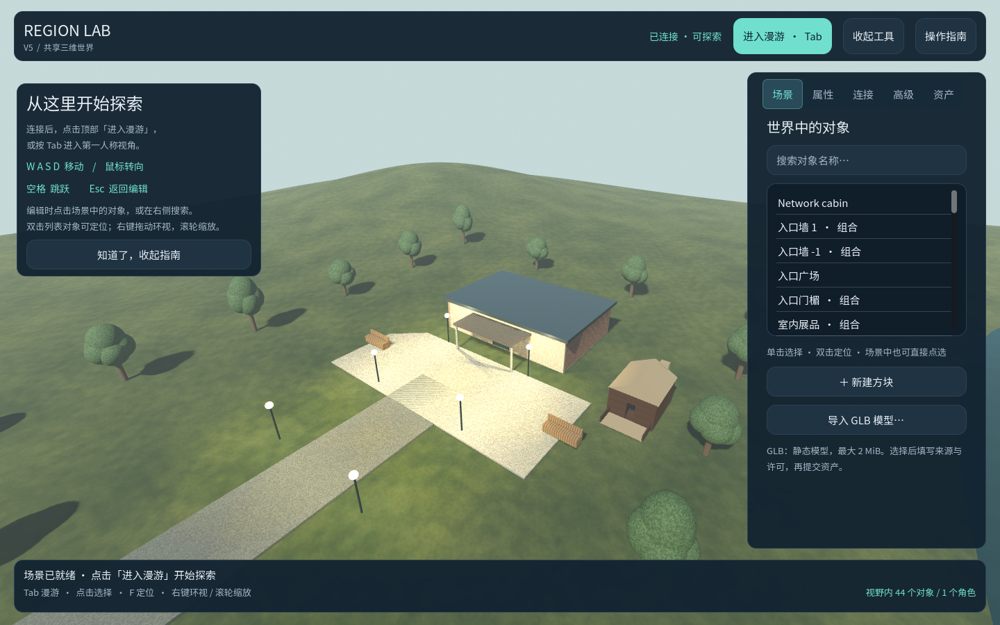
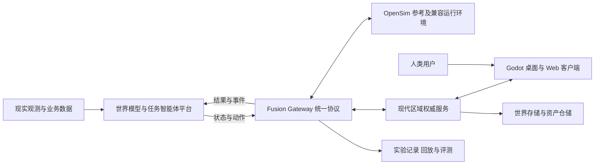

# 世界模型与智能体协作虚拟世界平台

本项目面向“现实世界—世界模型与智能体网络—虚拟世界镜像”的贯通目标，建设可观察、可操作、可恢复、可评测的三维试验环境。人类通过 Avatar 进入场景，与智能体共同执行任务；外部世界模型输出的状态与推演结果在场景中呈现，操作结果和专家反馈再回传平台，用于评测与后续学习。

项目以 **OpenSimulator 0.9.3.0** 为数据与行为参考，以 **Godot** 逐步重建现代客户端和区域能力。仓库保留原版 C# 源码，在 `prototype/` 中独立开发 **Region Lab**。总体目标依据老师提供的两份 [项目指导文档](docs/references/teacher/2026-09-15/README.md)，实施顺序及技术约束见 [目标对齐说明](docs/plans/platform-integration-alignment.md) 和 [版本路线](docs/plans/stage-one-rebuild-plan.md)。

**当前开发版本为 Region Lab V6 / 0.6.0。** V6-1～V6-5 已完成：持久身份与哈希会话、对象级权限、按哈希引用内容的个人库存、受控智能体接口与端到端智能体任务均已通过真实权威服务的端到端验收。V5 底座保持完整：现代 Godot 权威区域、桌面 / Web 客户端和 SQLite 共同组成可持续运行的共享世界，编辑经服务器验证并持久提交，客户端接收快照和增量；角色由服务端物理约束，浏览器按兴趣范围下载已授权资产。采用 Godot 4.5.1 标准版、Jolt、GDScript 和 WebGL2。默认 JSON 离线编辑器、V4 SQLite 模式及独立 OpenSim FP 0.2 网关继续保留。

V6 的入口见 [身份合同](docs/contracts/identity-v6.md)、[权限合同](docs/contracts/permits-v6.md)、[库存合同](docs/contracts/inventory-v6.md)、[智能体合同](docs/contracts/agents-v6.md) 及对应 [ADR 0002～0006](docs/adr/)；V5 的入口见 [共享区域运行指南](prototype/docs/network-quickstart.md)、[FP 0.3 合同](docs/contracts/network-v5.md) 和 [V5 验收记录](docs/comparisons/v5-completion.md)。原版参考、融合网关、真实建筑与事务仓储的历史证据见 [V4 验收报告](docs/comparisons/v4-completion.md)。



## 从 V3.1 / V4 进入 V5

在已有仓库根目录更新 main 分支。下列命令仍打开原离线编辑器：

```powershell
git fetch origin
git switch main
git pull --ff-only origin main
.\prototype\Start.cmd
```

V3.1 已安装的 Godot 4.5.1 可以复用。**体验 V5 多客户端请按 [网络启动步骤](prototype/docs/network-quickstart.md) 构建 RegionStore / RegionHost，创建新实例，然后使用 `Start-Network.ps1` 与 `Start-NetworkClient.ps1`。** Web 需额外导出单线程发布包。网络模式需要 PowerShell 7 和 ASP.NET Core 8 运行时；默认 JSON 模式没有新增运行依赖。初始化网络实例不会覆盖个人存档。

## 平台目标与职责

| 范围 | 本项目承担的能力 | 与外部平台的关系 |
| --- | --- | --- |
| 虚拟镜像 | 区域、地形、对象组合、资产、环境、角色与交互 | 将有来源、坐标和时间标记的观测或推演结果映射为场景状态 |
| 人机协作 | 人类 Avatar、受控 Bot、任务状态、专家标注与操作反馈 | 平台负责规划与重规划，虚拟世界执行受支持的动作并返回结果 |
| 融合接口 | Fusion Protocol（FP-01～09）、状态快照、增量、事件、动作与回执 | 网关适配 OpenSim 和现代区域服务；现代客户端消费统一协议 |
| 实验评测 | 场景版本、参数、事件记录、回放、反事实对比与遥测导出 | 为平台评估提供可追溯数据；专业水文、交通等机理计算由对应模型承担 |
| 渐进迁移 | 固定原版运行对照、OAR/IAR 内容迁移、旧协议兼容评估 | 保留原版兼容运行环境，按具体场景逐步迁移 |

以下为**目标架构**，各组件的当前状态以版本路线为准：



每个运行世界只有一个状态权威。原版实例与现代区域实例通过显式映射和实验分支关联；镜像消息保留来源，不以两个服务同时写入同一世界实现同步。

## 当前已实现能力

| 模块 | 当前桌面基础能力 |
| --- | --- |
| 区域与角色 | 高度场、区域边界、行走、跳跃、角色与场景碰撞 |
| 对象与组合 | 六类内置对象；创建、编辑、复制、删除；单层组合及整体变换；展馆包含 15 个部件 |
| 静态资产 | 受限 GLB 导入、资产复用、碰撞代理和内嵌 PNG；模型内容随快照保存 |
| 地形与环境 | 抬升、降低、设高、平滑；水面、固定太阳时刻、雾、程序材质 |
| 交互与历史 | 门灯开关、漫游交互；对象、组合、资产、地形与环境共用撤销重做 |
| 持久化 | JSON 快照及可选 SQLite 事务仓储、外置资产、自包含备份恢复；世界格式 3，可迁移格式 1/2 |
| 原版融合 | 独立 OpenSim Region 模块、FP 0.2、受控 Bot、事件、权限及持久回执 |
| 现代网络 | FP 0.3、只读客户端投影、服务端排序与修订冲突、持久幂等回执、断线 / 重启恢复 |
| 共享角色与权限 | 60 Hz 权威碰撞、20 Hz 状态分发、预测校正和远端插值、最小认证主体与对象权限 |
| V6 身份与会话 | 账户目录、SHA-256 哈希会话、所有者引导、帧内撤销踢出、生命周期审计 |
| V6 对象权限 | 对象级限制与按账户授权、默认拒绝、防自锁、配置一次性播种 |
| V6 资产库存 | 个人文件夹与条目按哈希引用内容、放置共享同一内容、导出包 v2 含服务表 |
| V6 受控智能体 | agent 角色封禁既有通道、observe/status/task/cancel 表面、四类任务白名单 |
| V6 智能体任务 | 调用方编排参考实现、障碍恢复、观察记录与动作回执文件化审计 |
| Web 客户端 | WebGL2、文件选择和下载、指针锁、距离兴趣过滤、授权 HTTPS 资产与完整性验证 |
| V4 验证输入 | 双浏览器 WebGL2 实验、真实测绘建筑、进程中断与迁移恢复测试 |
| 命令与验证 | WorldService 命令入口、离线 JSON 批处理、原生物理与界面测试 |

V5 回归包括 **191 项原生检查、66 项离线界面检查**、网络数据合同、真实双桌面进程、SQLite 故障注入和 Chromium / Firefox 联调。初始验收结果保留于 [V5 验收记录](docs/comparisons/v5-completion.md)。最新界面回归另有 39 项网络界面检查、64 项网络集成检查及 76 项浏览器检查通过，结果与初次失败记录见 [2026-09-20 界面验证](docs/comparisons/evidence/v5-ui-20260920/README.md)，操作见 [界面说明](prototype/docs/network-interface.md)。系统交接及组会 Word 文档见 [汇报文档库](docs/reports/README.md)。此前 43 对象日景与 243 对象夜景的结果仍只作为同机历史基线。

V6 回归基线（2026-09-21，本机）：存储套件 **137/137**（含 schema 4～7 迁移与回滚夹具）、身份 **29/29**、权限 **37/37**、库存 **31/31**、智能体表面 **50/50**、端到端智能体任务 **18/18**（含超时 / 取消 / 重复 / 越权四类可复现失败形态）、网络集成 **64/64**。各套件的验证口径见对应合同文档末节。

当前 GLB 限定静态三角网格、不透明材质及内嵌 PNG，单文件 ≤2 MiB、三角形 ≤20,000，最多 16 个导入资产；完整快照 ≤8 MiB。原有三个 CC0 样本用于功能验证；V4 新增具有原始测绘来源和许可记录的 [Pioneer Log Cabin](prototype/fixtures/buildings/pioneer-log-cabin/README.md)，完成真实碰撞与搬移恢复验收。

## 后续版本与实现目标

| 版本 | 核心交付 | 进入下一阶段的依据 |
| --- | --- | --- |
| V4（已完成） | 原版运行对照、FP 契约与最小网关、存储抽象和数据库 | 两部件行为可对照；原版状态—动作—回执贯通；数据事务与恢复通过 |
| V5（已完成） | 现代区域权威服务、双客户端同步、Web 轻客户端 | 桌面与浏览器观察同一状态；逐项状态与性能门槛见验收记录 |
| V6（当前） | 持久身份与对象权限、内容库存、受控智能体与端到端任务 | 人类与 Bot 完成任务并产出可审计回执；平台联调与实验回放待联调窗口 |
| V7 | 真实场景资产、OAR 子集迁移、分块加载与画质分档 | 可追溯场景可迁移、可通行、可按需加载；达到明确的客户端预算 |
| V8 | 分级容量验证、跨区域与多端部署、国产算力适配 | 按硬件和负载报告容量、延迟、稳定性及适配结果 |
| 专题阶段 | WebGPU、GPU 物理、完整旧协议与脚本兼容、联邦及云渲染 | 先取得技术验证和业务必要性证据，再确定独立版本范围 |

详细子版本、依赖、任务和验收见 [总体路线](docs/plans/stage-one-rebuild-plan.md) 与 [V5 实施计划](docs/plans/v5-implementation-plan.md)。任务按个人串行推进安排，原材料中的 18 个月总周期和 4 个月客户端周期保留为项目层参考，不直接作为个人工期承诺。

### 客户端技术基线

近期 Web 路线采用 **GDScript + Compatibility / WebGL2 + WebSocket**，先完成导出与网络验证。固定 Godot 4.5 系列的官方 Web 能力不包含 WebGPU 和 C# Web 导出；WebGPU 保留为后续引擎能力验证专题，升级须重新锁定版本并通过回归。[Godot 4.5 Web 导出说明](https://docs.godotengine.org/en/4.5/tutorials/export/exporting_for_web.html)

桌面与 Web 使用 Jolt。Web 当前采用单线程、顶点光照、关闭动态阴影与 MSAA 的固定轻量画面配置；桌面保留原画面。现代权威进程复用生产 GDScript 领域和物理代码；ASP.NET Core 8 提供 HTTP / WebSocket 入口，C# RegionStore 和 SQLite 提供持久化。WebTransport、消息总线及 GPU 仿真仍需后续独立验证。

## 安装与启动当前原型

Windows x64 环境需要 PowerShell 5.1、支持 OpenGL 3.3 的显卡及正常驱动。

```powershell
git clone --branch main https://github.com/StarryLiu1122/OpenSim.git
cd OpenSim\prototype
.\Install.cmd
.\Start.cmd
```

安装脚本下载并校验固定 Godot 官方归档。默认 JSON 桌面模式不依赖 .NET、Python、数据库或 API Key；可选 SQLite 模式另需 .NET 8 运行时，原版网关与各测试工具的依赖分别记录。离线安装、独立存档和操作方法见 [原型使用说明](prototype/README.md)。

体验新建展馆组合可指定独立路径：

```powershell
.\Start.cmd -WorldFile "$PWD\runtime\v4-demo.json"
```

## 文档库

| 入口 | 内容 |
| --- | --- |
| [文档库目录](docs/README.md) | 原始材料、项目规划、使用与验证文档导航 |
| [老师提供的两份原件](docs/references/teacher/2026-09-15/README.md) | 原始 Word 文件、版本、来源及 SHA256 |
| [目标与技术路线对齐](docs/plans/platform-integration-alignment.md) | 原文要求、当前差距、FP 映射及技术核实 |
| [版本路线](docs/plans/stage-one-rebuild-plan.md) | V4～V8 子版本、依赖与发布条件 |
| [V4 实施计划](docs/plans/v4-implementation-plan.md) | 首轮任务、输入、交付物、验收案例与决策点 |
| [V4 执行记录](docs/plans/v4-progress.md) | 21 项完成情况、验收证据和下一阶段输入 |
| [V5 运行指南](prototype/docs/network-quickstart.md) | 服务、双桌面、Web、会话、备份和故障处理 |
| [V5 协议合同](docs/contracts/network-v5.md) | 主体、序列、事务、回执、角色、AOI 与资产 |
| [V6 合同与 ADR](docs/contracts/agents-v6.md) | 身份、权限、库存、智能体四份合同与 ADR 0002～0006 决策记录 |
| [V5 验收记录](docs/comparisons/v5-completion.md) | 12 项任务、实测证据及性能门槛 |
| [原版集成工具](integration/README.md) | 固定构建、区域模块、Bot、接口和跨实现测试 |
| [原型架构与接口](prototype/docs/architecture-and-api.md) | 已实现的领域模型、命令与快照协议 |
| [数据对应](prototype/docs/opensim-data-mapping.md) | 原版源码入口、语义映射与差异 |
| [组合与资产规范](prototype/docs/groups-and-assets.md) | 局部变换、静态 GLB 支持范围与存储限制 |
| [技术选型](prototype/docs/engine-decision.md) | 当前引擎、语言及实现取舍 |
| [验证记录](prototype/docs/verification.md) | 已执行检查及未验证边界 |

## 仓库结构

```text
prototype/           Region Lab 已实现的 Godot 原型
  godot/domain/      世界数据、命令与地形算法
  godot/adapters/    场景、碰撞、资产与快照存储
  godot/client/      角色与编辑界面
  godot/network/     现代权威区域、只读投影与桌面 / Web 客户端
  godot/tests/       数据、物理、界面与跨进程检查
  tools/             安装、启动、测试与性能测量
  fixtures/          命令、旧格式存档及 GLB 样本
  docs/              当前接口、操作和验证证据
services/            SQLite 仓储与 ASP.NET Core 入口
integration/         原版 FP 网关、Bot、Web 与跨进程验收工具
OpenSim/             原版区域、服务、脚本、物理与数据访问源码
Prebuild/            原版工程生成工具
ThirdParty/          原版第三方源码
bin/                 上游依赖与配置模板
docs/
  references/        老师提供的原始材料及来源登记
  plans/             目标对齐、版本路线与实施计划
  upstream/          上游原始说明
```

服务职责、运行依赖及当前限制分别以对应目录说明和合同为准。

## 开发与验证

从最新 `main` 创建 `codex/` 分支，每次完成一项有明确验收条件的变更。遵守 [原型 AGENTS.md](prototype/AGENTS.md)：持久化世界与引擎节点分离，界面和自动化修改统一经过 `WorldService`，测试使用独立目录。

在 `prototype` 目录执行现有完整检查：

```powershell
powershell.exe -NoProfile -ExecutionPolicy Bypass -File .\tools\Test-RegionLab.ps1 -Visual
```

原版构建参考 [BUILDING.md](BUILDING.md)，固定基线见 [源码来源](docs/UPSTREAM.md)。V4 对照使用独立原版实例、BulletSim 和 YEngine；现代桌面使用 Jolt，两者的组身份与缩放表达保留显式映射。已完成的测试不构成断电、跨平台、大规模场景或长期稳定性保证。Viewer 兼容的权限与库存语义、SSO、LSL/OSSL、OAR、CAD/BIM、真实平台联调和在线模型仍未交付（V6 的身份 / 权限 / 库存为现代区域的独立实现）。

## 上游与许可证

OpenSimulator 参考提交为 `1f4a6dd1d3ff653ecc2748a7764106c30ac4ef9d`，保留 [LICENSE.txt](LICENSE.txt)、[CONTRIBUTORS.txt](CONTRIBUTORS.txt) 和 [ThirdPartyLicenses](ThirdPartyLicenses/)。第三方组件适用各自许可证。老师提供的原始文档按其来源登记保存，源码许可证不自动授予这些文档的再许可权利。
