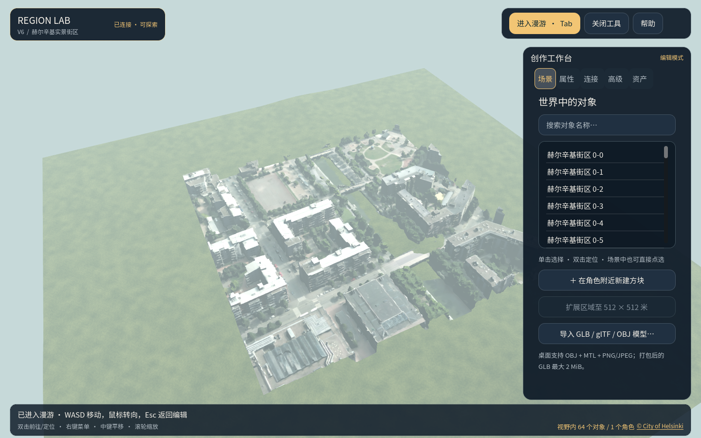

# Region Lab：可漫游的真实街区

这个分支提供一个基于 Godot 的共享三维世界原型。当前可直接打开赫尔辛基 **250 × 250 米**航拍建模街区：走路、快跑、飞行、查看地点，或在有编辑权限时放置物体和导入模型。场景由 64 块带照片纹理的网格组成，放在 512 × 512 米的区域内。



## 安装并打开

目前的一键入口适用于 **Windows x64**。需要支持 OpenGL 3.3 的显卡、**.NET SDK 8.0.424**，以及首次安装 Godot 和构建服务时的网络连接。安装脚本使用固定的 Godot 4.5.1；已有该版本时会复用。正常打开场景不需要 Python、模型 API Key 或独立数据库服务器。

在 PowerShell 中运行：

```powershell
git clone --branch codex/real-scene-pilot https://github.com/StarryLiu1122/OpenSim.git
cd OpenSim

.\prototype\Install.cmd
dotnet build .\services\RegionStore\RegionStore.csproj -c Release
dotnet build .\services\RegionHost\RegionHost.csproj -c Release
.\prototype\打开赫尔辛基250米实景.cmd
```

已有仓库时，先在**没有未保存改动**的工作区执行 `git fetch origin`、`git switch codex/real-scene-pilot` 和 `git pull --ff-only origin codex/real-scene-pilot`，再从安装命令继续。也可以在文件管理器中双击 [`prototype/打开赫尔辛基250米实景.cmd`](prototype/打开赫尔辛基250米实景.cmd)。首次打开要构建独立场景和本机服务，可能需要约一分钟；以后会复用该场景。看到顶部“已连接 · 可探索”后，就可以开始操作。

启动器会打开桌面客户端，并在后台运行区域服务。**关闭客户端窗口不会停止服务。** 用完后，在仓库根目录运行：

```powershell
.\prototype\tools\Stop-Network.ps1 -Directory .\prototype\runtime\helsinki-kamppi-v7-250m\network
```

再次进入时重新运行一键入口即可。若提示端口被占用，先检查 `20830–20832` 是否已有这个场景的服务在运行；不要同时启动两个写入同一运行目录的服务。启动和存档问题见[完整运行指南](prototype/docs/network-quickstart.md)。

想在更完整的街道里近看建筑贴图，可双击 [`prototype/打开高清街区体验.cmd`](prototype/打开高清街区体验.cmd)。它打开约 **80 米长**、两侧共 16 栋建筑的独立街景，含人行道、斑马线和路灯；从街道西端出生，按 Tab 后可沿路漫游。[实际俯瞰画面](prototype/docs/images/polyhaven-street-80m-overview.png)与[街面漫游画面](prototype/docs/images/polyhaven-street-80m-walk.png)可预览。建筑由 [Poly Haven 的 CC0 素材](prototype/fixtures/geodata/polyhaven-urban-apartment/README.md)拼装，**不对应真实地址**；需要真实地理范围时请使用上面的赫尔辛基入口。

较小的两栋公寓近景样例仍可双击 [`prototype/打开高清建筑模型体验.cmd`](prototype/打开高清建筑模型体验.cmd)，其中还有一扇涂鸦卷帘窗。[实际客户端画面](prototype/docs/images/polyhaven-urban-apartment.png)可供核对。

使用后可停止街道或两栋公寓样例的本地服务：

```powershell
.\prototype\tools\Stop-Network.ps1 -Directory .\prototype\runtime\polyhaven-street-v4\network
# 如果还打开了两栋公寓样例，再运行：
.\prototype\tools\Stop-Network.ps1 -Directory .\prototype\runtime\polyhaven-urban-apartment-v2\network
```

## 走路、快跑和飞行

先点击窗口顶部的“进入漫游”，或在没有输入文字时按 **Tab**。鼠标会控制视线，右侧建造面板会收起。

| 操作 | 按键或方式 |
| --- | --- |
| 前后左右移动 | **W / S / A / D** |
| 转头、抬头、低头 | 移动鼠标 |
| 快跑 | 移动时按住 **Shift** |
| 跳跃 | 地面漫游时按 **空格** |
| 开始飞行 | 按 **F** |
| 飞行中升高 / 降低 | **空格 / Ctrl** |
| 飞行中水平移动 | **WASD**，鼠标控制方向 |
| 结束飞行 | 再按 **F**；角色会受重力下降 |
| 使用附近的门或灯 | 出现互动提示时按 **E** |
| 返回编辑视角 | **Esc**，也可再按 **Tab** |

飞行和快跑需要连接的服务支持相应能力；本分支的一键场景已启用。飞行高度受到服务端限制。自动“前往此处”被建筑挡住时会停止，按 WASD 可以随时接管移动。

## 看场景、前往地点和建造

按 **Esc** 返回编辑视角后，可用鼠标观察场景：

| 操作 | 按键或方式 |
| --- | --- |
| 环绕视角 | 按住**右键拖动** |
| 平移视角 | 按住**中键拖动** |
| 拉近 / 拉远 | **滚轮**，或 **Ctrl+0 / Ctrl+8** |
| 重置俯瞰视角 | **Home** 或 **Ctrl+9** |
| 聚焦某一点 | **Alt+左键** |
| 选择或定位物体 | 单击物体选中；双击物体或按 **F** 定位 |
| 前往地面位置 | 双击地面；或右键单击地面，选“前往此处” |
| 打开地点菜单 | **右键单击**地点，不拖动 |

地点菜单还可以“在此建造方块”“在此放置当前模型”和“聚焦此处”。可编辑对象能够在右侧“属性”页修改名称和位置，点击**“保存对象修改”**后才会提交。场景页也有“在角色附近新建方块”；选择对象后可切换自己的门或灯、确认删除。只读账户可以查看和漫游，不能建造。

导入自己的静态模型：在“场景”页选择 **GLB / glTF / OBJ**，到“资产”页填写名称、真实许可与来源，点击“提交模型资产”；收到成功提示后，选择该模型并点击“将模型放到角色前方”。桌面 OBJ 可使用同目录的 MTL 和 PNG/JPEG。单件转换后的 GLB 最多 **2 MiB**、**20,000 个三角面**，世界最多 **64 个导入网格**，完整存档仍限 **8 MiB**。具体支持格式与拒绝原因见[模型导入说明](prototype/docs/quality-import-and-navigation.md)。

## 当前范围与更多资料

赫尔辛基场景来自 **2017 年航拍重建**，有原始照片纹理，但近距离表面和建筑室内还不够精细；当前展示的是一个静态街区，不是整座城市。来源、许可和转换过程见[场景说明](prototype/docs/helsinki-textured-city-pilot.md)。V6.1 已有外部水位预测的离线校验与坐标映射入口；真实平台回注、实验回放以及 V7 的分块加载和 LOD 尚未完成，见[版本进度](prototype/docs/v6-v7-progress.md)。

如果只想体验原来的单机编辑器，可运行 `prototype/Start.cmd`；它和上面的一键共享场景是两个独立入口。更完整的网络操作见[界面说明](prototype/docs/network-interface.md)，项目规划和技术合同收录在[文档目录](docs/README.md)。本仓库保留 OpenSimulator 参考源码，许可见 [LICENSE.txt](LICENSE.txt)；赫尔辛基场景素材按其清单所列的 CC BY 4.0 署名使用。
