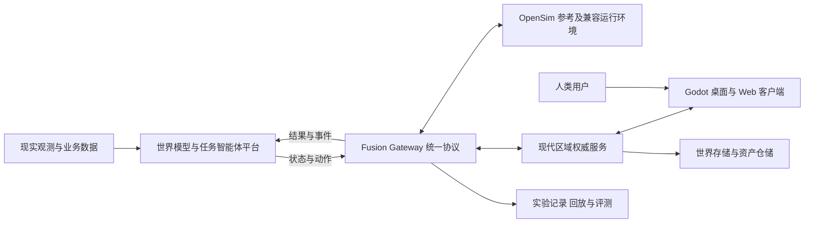

# 世界模型与智能体协作虚拟世界平台

本项目面向“现实世界—世界模型与智能体网络—虚拟世界镜像”的贯通目标，建设可观察、可操作、可恢复、可评测的三维试验环境。人类通过 Avatar 进入场景，与智能体共同执行任务；外部世界模型输出的状态与推演结果在场景中呈现，操作结果和专家反馈再回传平台，用于评测与后续学习。

项目以 **OpenSimulator 0.9.3.0** 为数据与行为参考，以 **Godot** 逐步重建现代客户端和区域能力。仓库保留原版 C# 源码，在 `prototype/` 中独立开发 **Region Lab**。总体目标依据老师提供的两份 [项目指导文档](docs/references/teacher/2026-09-15/README.md)，实施顺序及技术约束见 [目标对齐说明](docs/plans/platform-integration-alignment.md) 和 [版本路线](docs/plans/stage-one-rebuild-plan.md)。

**当前桌面交付版本为 Region Lab V3.1 / 0.3.1：Windows 本机单用户、256×256 米单区域编辑原型。V4 已开始实施，首批原版运行对照与实验适配器为 0.4.0-dev。** 当前桌面采用 Godot 4.5.1 标准版、Jolt 和 GDScript；现代数据库、多人客户端、完整 FP 网关和在线模型尚未交付。

V4 已在独立目录构建并运行固定 OpenSim，接入受控 Bot，完成两部件静态变换与正常重启的核心对照。启动与复现见 [V4 集成工具](integration/README.md)，实际结果及未完成项见 [运行对照](docs/comparisons/v4-reference-linkset.md) 和 [21 项任务执行记录](docs/plans/v4-progress.md)。


## 平台目标与职责

| 范围 | 本项目承担的能力 | 与外部平台的关系 |
| --- | --- | --- |
| 虚拟镜像 | 区域、地形、对象组合、资产、环境、角色与交互 | 将有来源、坐标和时间标记的观测或推演结果映射为场景状态 |
| 人机协作 | 人类 Avatar、受控 Bot、任务状态、专家标注与操作反馈 | 平台负责规划与重规划，虚拟世界执行受支持的动作并返回结果 |
| 融合接口 | Fusion Protocol（FP-01～09）、状态快照、增量、事件、动作与回执 | 网关适配 OpenSim 和现代区域服务；现代客户端消费统一协议 |
| 实验评测 | 场景版本、参数、事件记录、回放、反事实对比与遥测导出 | 为平台评估提供可追溯数据；专业水文、交通等机理计算由对应模型承担 |
| 渐进迁移 | 固定原版运行对照、OAR/IAR 内容迁移、旧协议兼容评估 | 保留原版兼容运行环境，按具体场景逐步迁移 |

以下为**目标架构**，各组件的当前状态以版本路线为准：



每个运行世界只有一个状态权威。原版实例与现代区域实例通过显式映射和实验分支关联；镜像消息保留来源，不以两个服务同时写入同一世界实现同步。

## 当前已实现能力

| 模块 | V3.1 范围 |
| --- | --- |
| 区域与角色 | 高度场、区域边界、行走、跳跃、角色与场景碰撞 |
| 对象与组合 | 六类内置对象；创建、编辑、复制、删除；单层组合及整体变换；展馆包含 15 个部件 |
| 静态资产 | 受限 GLB 导入、资产复用、碰撞代理和内嵌 PNG；模型内容随快照保存 |
| 地形与环境 | 抬升、降低、设高、平滑；水面、固定太阳时刻、雾、程序材质 |
| 交互与历史 | 门灯开关、漫游交互；对象、组合、资产、地形与环境共用撤销重做 |
| 持久化 | 完整世界快照、校验和、有效备份、重启恢复；世界格式 3，可迁移格式 1/2 |
| 命令与验证 | WorldService 命令入口、离线 JSON 批处理、原生物理与界面测试 |

已保存的 V3.1 报告记录 **188 项原生检查、66 项界面检查**通过，其中界面检查包含 7 项截图生成检查；跨进程恢复、删除 GLB 源文件后的可搬移恢复和独立目录安装通过。43 对象日景与 243 对象夜景的性能结果是同机短时基线。详见 [验证记录](prototype/docs/verification.md) 与 [性能说明](prototype/docs/performance.md)。

当前 GLB 限定静态三角网格、不透明材质及内嵌 PNG，单文件 ≤2 MiB、三角形 ≤20,000，最多 16 个导入资产；完整快照 ≤8 MiB。三个 CC0 样本用于功能验证，真实授权建筑验收列入 V4。

## 后续版本与实现目标

| 版本 | 核心交付 | 进入下一阶段的依据 |
| --- | --- | --- |
| V4 | 原版运行对照、FP 契约与最小网关、存储抽象和数据库 | 两部件行为可对照；原版状态—动作—回执贯通；数据事务与恢复通过 |
| V5 | 现代区域权威服务、双客户端同步、Web 轻客户端 | 桌面与浏览器观察同一状态，冲突、断线与重启后收敛 |
| V6 | 身份库存、受控智能体、平台联调与实验回放 | 人类与 Bot 完成任务；推演回注、专家反馈和遥测形成闭环 |
| V7 | 真实场景资产、OAR 子集迁移、分块加载与画质分档 | 可追溯场景可迁移、可通行、可按需加载；达到明确的客户端预算 |
| V8 | 分级容量验证、跨区域与多端部署、国产算力适配 | 按硬件和负载报告容量、延迟、稳定性及适配结果 |
| 专题阶段 | WebGPU、GPU 物理、完整旧协议与脚本兼容、联邦及云渲染 | 先取得技术验证和业务必要性证据，再确定独立版本范围 |

详细子版本、依赖、任务和验收见 [总体路线](docs/plans/stage-one-rebuild-plan.md)；V4 按 [实施计划](docs/plans/v4-implementation-plan.md) 推进，逐项状态见 [执行记录](docs/plans/v4-progress.md)。任务按个人串行推进安排，原材料中的 18 个月总周期和 4 个月客户端周期保留为项目层参考，不直接作为个人工期承诺。

### 客户端技术基线

近期 Web 路线采用 **GDScript + Compatibility / WebGL2 + WebSocket**，先完成导出与网络验证。固定 Godot 4.5 系列的官方 Web 能力不包含 WebGPU 和 C# Web 导出；WebGPU 保留为后续引擎能力验证专题，升级须重新锁定版本并通过回归。[Godot 4.5 Web 导出说明](https://docs.godotengine.org/en/4.5/tutorials/export/exporting_for_web.html)

当前桌面版本继续使用 Jolt。浏览器导出、物理行为和线程要求在 V4.0 单独验证。服务端语言、数据库、WebTransport、消息总线及 GPU 仿真方案均需通过相应设计决策，不能由目标架构中的候选名称推定为已集成依赖。

## 安装与启动当前原型

Windows x64 环境需要 PowerShell 5.1、支持 OpenGL 3.3 的显卡及正常驱动。

```powershell
git clone --branch main https://github.com/StarryLiu1122/OpenSim.git
cd OpenSim\prototype
.\Install.cmd
.\Start.cmd
```

安装脚本下载并校验固定 Godot 官方归档。当前原型运行不依赖 .NET、Python、数据库或 API Key；后续原版对照、服务端与模型接入会分别说明新增依赖。离线安装、独立存档和操作方法见 [原型使用说明](prototype/README.md)。

体验新建展馆组合可指定独立路径：

```powershell
.\Start.cmd -WorldFile "$PWD\runtime\v31-demo.json"
```

## 文档库

| 入口 | 内容 |
| --- | --- |
| [文档库目录](docs/README.md) | 原始材料、项目规划、使用与验证文档导航 |
| [老师提供的两份原件](docs/references/teacher/2026-09-15/README.md) | 原始 Word 文件、版本、来源及 SHA256 |
| [目标与技术路线对齐](docs/plans/platform-integration-alignment.md) | 原文要求、当前差距、FP 映射及技术核实 |
| [版本路线](docs/plans/stage-one-rebuild-plan.md) | V4～V8 子版本、依赖与发布条件 |
| [V4 实施计划](docs/plans/v4-implementation-plan.md) | 首轮任务、输入、交付物、验收案例与决策点 |
| [V4 执行记录](docs/plans/v4-progress.md) | 已实现增量、21 项任务状态、缺口和下一批顺序 |
| [原版集成工具](integration/README.md) | 固定构建、区域模块、Bot、接口和跨实现测试 |
| [原型架构与接口](prototype/docs/architecture-and-api.md) | 已实现的领域模型、命令与快照协议 |
| [数据对应](prototype/docs/opensim-data-mapping.md) | 原版源码入口、语义映射与差异 |
| [组合与资产规范](prototype/docs/groups-and-assets.md) | 局部变换、静态 GLB 支持范围与存储限制 |
| [技术选型](prototype/docs/engine-decision.md) | 当前引擎、语言及实现取舍 |
| [验证记录](prototype/docs/verification.md) | 已执行检查及未验证边界 |

## 仓库结构

```text
prototype/           Region Lab 已实现的 Godot 原型
  godot/domain/      世界数据、命令与地形算法
  godot/adapters/    场景、碰撞、资产与快照存储
  godot/client/      角色与编辑界面
  godot/tests/       数据、物理、界面与跨进程检查
  tools/             安装、启动、测试与性能测量
  fixtures/          命令、旧格式存档及 GLB 样本
  docs/              当前接口、操作和验证证据
OpenSim/             原版区域、服务、脚本、物理与数据访问源码
Prebuild/            原版工程生成工具
ThirdParty/          原版第三方源码
bin/                 上游依赖与配置模板
docs/
  references/        老师提供的原始材料及来源登记
  plans/             目标对齐、版本路线与实施计划
  upstream/          上游原始说明
```

网关、现代区域服务和独立客户端的目录将在对应版本立项时建立，当前仓库结构不代表这些组件已经完成。

## 开发与验证

从最新 `main` 创建 `codex/` 分支，每次完成一项有明确验收条件的变更。遵守 [原型 AGENTS.md](prototype/AGENTS.md)：持久化世界与引擎节点分离，界面和自动化修改统一经过 `WorldService`，测试使用独立目录。

在 `prototype` 目录执行现有完整检查：

```powershell
powershell.exe -NoProfile -ExecutionPolicy Bypass -File .\tools\Test-RegionLab.ps1 -Visual
```

原版构建参考 [BUILDING.md](BUILDING.md)，固定基线见 [源码来源](docs/UPSTREAM.md)。V4 首批已完成固定原版独立运行及核心静态对象对照，详见 [证据记录](docs/comparisons/v4-reference-linkset.md)。Bot 库退出兼容性、完整权限、Web 与真实建筑验收仍待完成；新增数据库和实验能力须各自补充故障、事务、恢复及回放验证。

## 上游与许可证

OpenSimulator 参考提交为 `1f4a6dd1d3ff653ecc2748a7764106c30ac4ef9d`，保留 [LICENSE.txt](LICENSE.txt)、[CONTRIBUTORS.txt](CONTRIBUTORS.txt) 和 [ThirdPartyLicenses](ThirdPartyLicenses/)。第三方组件适用各自许可证。老师提供的原始文档按其来源登记保存，源码许可证不自动授予这些文档的再许可权利。
