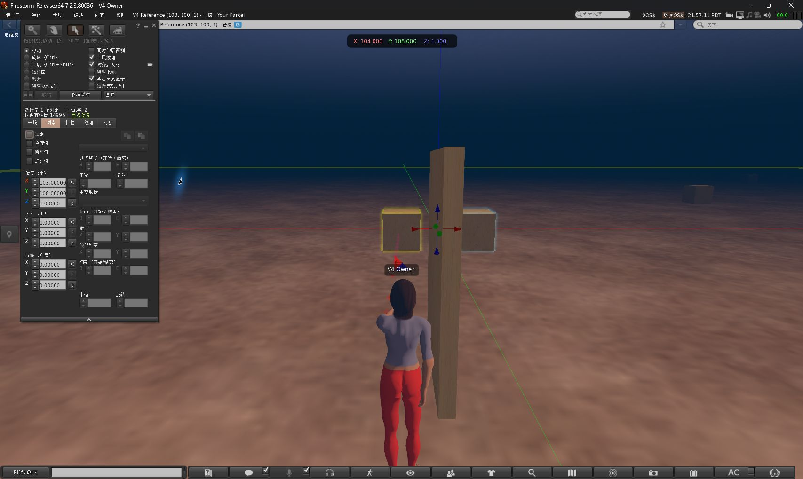
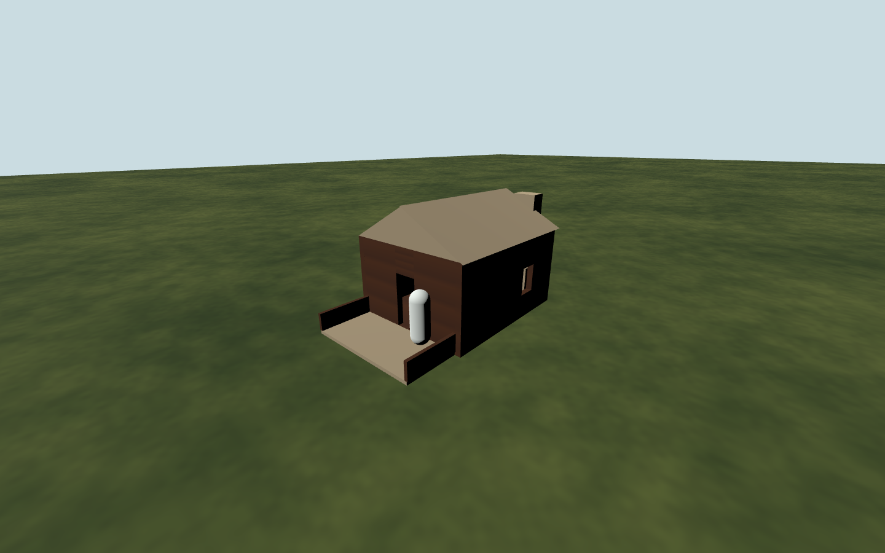
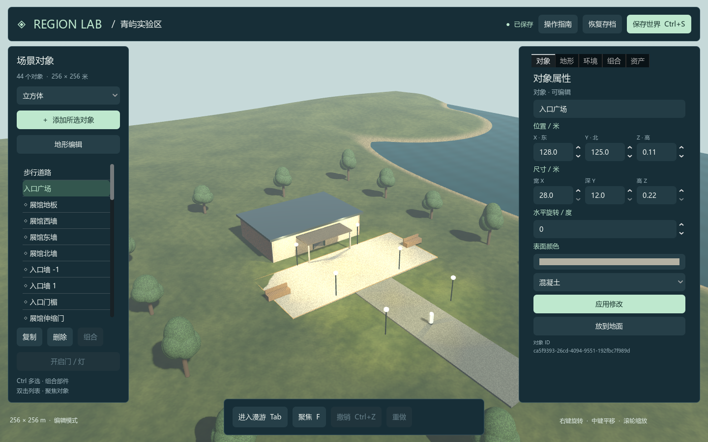

# V4.0～V4.2 综合验收报告

日期：2026-09-16。桌面 **0.4.2**；FusionRegionModule / ReferenceBot **0.4.1**；FP **0.2**。分支：`codex/region-lab-v4`。

## 1. 结论与范围

[实施计划](../plans/v4-implementation-plan.md) 的 21 项任务已完成各自声明的最小工程验收，逐项依据见 [执行记录](../plans/v4-progress.md)。本轮提供运行代码、固定依赖、建筑样例、协议与存储合同、隔离测试、运行文档及脱敏证据。

交付包含三条独立路径：桌面原型保留 JSON 并新增 SQLite；固定 OpenSim 区域与模拟平台完成 FP 状态—动作—事件—回执闭环；浏览器运行生产 GDScript 的最小 WebGL2 场景。这些路径没有同时写入同一运行世界。现代多人权威服务、真实世界模型平台、完整身份库存和在线大模型属于后续版本。

## 2. 实测环境

| 项目 | 输入与实际配置 |
| --- | --- |
| 主机 | Windows 11 x64 10.0.26200；Intel Core Ultra 7 255HX；RTX 5060 Laptop GPU，驱动 592.01 |
| 桌面 | Godot 4.5.1 `f62fdbde1` 标准版/GDScript、Compatibility/OpenGL 3.3、Jolt |
| 原版 | [锁文件](../../integration/opensim/reference.lock.json) 固定 0.9.3.0 源树；独立单区域、SQLite、YEngine、BulletSim；[构建记录](v4-reference-linkset.md) |
| 网关构建 | .NET SDK 8.0.424；独立 Region 模块和 Bot，不修改原版内核 |
| 客户端库 | [client.lock.json](../../integration/opensim/client.lock.json) 固定提交和协作退出补丁；[实际 DLL 摘要](evidence/v4-complete-20260916/gateway/client-build-report.json) |
| Viewer | Firestorm OpenSim 7.2.3.80036；仅用本机隔离测试账户 |
| 浏览器 | Playwright 1.62.1，Chromium 151.0.7922.34、Firefox 153.0；Node 24.19.0 |
| Web 模板 | Godot 4.5.1 官方模板，大小及 SHA256 见 [锁文件](../../integration/web/web.lock.json) |
| SQLite | Microsoft.Data.Sqlite 10.0.12、SQLitePCLRaw 2.1.12；实际 SQLite 3.53.3；[依赖锁](../../services/RegionStore/packages.lock.json) |
| 数据版本 | 世界 3、快照封装 1、本地命令 1、数据库 schema 2、导出 bundle 1，各自独立 |

默认桌面 JSON 运行只需 Godot；SQLite 另需 .NET 8 运行时。SDK、浏览器及 Python 属相应构建/测试依赖。客户端库保留上游未使用语音/外观相关构建警告，不宣称所有依赖零警告。

## 3. 验收矩阵

证据入口：[v4-complete-20260916](evidence/v4-complete-20260916/README.md)。不同层次的检查不相加为覆盖率，截图生成检查不代表视觉评分。

| 测试层 | 结果 | 证据与口径 |
| --- | --- | --- |
| 桌面原生 | **188 / 188** | [报告](evidence/v4-complete-20260916/desktop/native-report.json)，最终启动改动后重跑 |
| 桌面 UI | **66 / 66** | [报告](evidence/v4-complete-20260916/desktop/visual-report.json)，含 7 项截图生成检查，实际渲染另行检查 |
| 跨进程与批处理 | **2 类恢复、3 组批处理通过** | [汇总](evidence/v4-complete-20260916/desktop/summary.json)，包含删除 GLB 源、搬移快照后恢复 |
| 两部件历史基线 | **原版 81、现代 40、比较 130 项** | 保留 [首批报告](v4-reference-linkset.md)，每分量容差 0.0002，不代表物理确定性 |
| Viewer 补充 | **实际观察通过** | [观察记录](evidence/v4-complete-20260916/viewer/viewer-report.json)，根/子坐标、编号、名称和选择范围对应权威 JSON |
| Web 正例 | **6 配置通过** | [矩阵](evidence/v4-complete-20260916/web/report.json)，每次初态/重载执行同一 11 项场景检查，另验文件和缓存 |
| Web 部署反例 | **2 个按预期拒绝启动** | 两种内核线程构建移除隔离头，作为明确的部署限制 |
| 真实建筑 | **13 写入 + 11 恢复** | [写入](evidence/v4-complete-20260916/building/building-write.json)、[恢复](evidence/v4-complete-20260916/building/building-read.json)，真实碰撞及另进程恢复 |
| FP 正常/权限 | **42 / 42** | [报告](evidence/v4-complete-20260916/gateway/normal-report.json)，实际 HTTP、原版区域和协议 Bot |
| FP 重启/故障 | **30 / 30** | [报告](evidence/v4-complete-20260916/gateway/recovery-report.json)，五个进程世代，实际终止测试 Bot/服务 |
| FP 结构合同 | **282 / 282** | [报告](evidence/v4-complete-20260916/gateway/schema-report.json)，41 样例及实际请求、回执、状态和事件 |
| SQLite | **44 / 44** | [报告](evidence/v4-complete-20260916/storage/report.json)，使用离线发布产物，含真实竞争及中断 |
| SQLite 适配 | **12 / 12** | [报告](evidence/v4-complete-20260916/storage/adapter-report.json)，空库、恢复、冲突、脏状态和生产校验 |
| 公开启动入口 | **6 / 6** | [报告](evidence/v4-complete-20260916/storage/desktop-report.json)，含空格路径，44 对象、1 组、建筑资产、修订 3、已保存 |
| 文档化回滚 | **3 / 3** | [报告](evidence/v4-complete-20260916/storage/deployment-report.json)，save→backup→新提交→独立 import/load；完整世界深比较 |
| 离线部署 | **通过** | [交付包检查](evidence/v4-complete-20260916/package-report.json)，新目录核验文件清单、安装和启动；系统已有 .NET 8 |

## 4. 原版与 FP

C01～C09 使用两个 1 米立方体核对建组、移动、Z 旋转、子部件调整、缩放、复制、解除及重启。原版组 ID 等于根 ID，现代组 ID 独立；原版缩放改写偏移/尺寸，现代保留组倍率。比较各自合成的世界位姿，不能直接复制同名字段。

Viewer 补充中根位于 `[103,108,1]`，子位于 `[105,108,1]`。面板显示根名 `Viewer root` 和两部件；链接编辑显示子编号 2。整体操作轴中心 `[104,108,1]` 与根位置不同，结论同时依据面板和 [权威状态](evidence/v4-complete-20260916/viewer/viewer-final-state.json)。截图中另有此前受控门实验的独立部件，不属于该组合。

FP 九类接口按 [正式合同](../contracts/fp-v02.md) 声明子集。快照与事件来自区域帧观察，事件为实体 upsert/delete。MOVE_TO 判定实际距离和速度，TURN 判定实际朝向；交互核对归属、距离和保守遮挡。不可达、取消及 Bot 消失产生明确终态。三类主体分别验证，观察者不接收所有者字段。

完成回执跨重启保留，旧世代命令不再次执行；prepared 动作遇服务进程终止返回 `result_unknown`，不会自动重放或生成 Bot。冷启动后的显式 spawn 仅针对原版特定 presence 拒绝重试一次。三轮正常生命周期及崩溃恢复均确认退出。

[epoch-1](evidence/v4-complete-20260916/gateway/epoch-1/commands-and-receipts.json) 保留初态、命令、回执、事件、trace 和遥测；后续 epoch 记录故障查询。遥测为有界缓冲区导出，不是完整长期实验数据库。模块重启采用进程冷重启，未验证运行中 DLL 热替换。

## 5. 建筑与浏览器

Pioneer Log Cabin 来自美国国会图书馆 HABS 测绘图。[建筑目录](../../prototype/fixtures/buildings/pioneer-log-cabin/README.md) 保存原 TIFF、来源/权利页、图示与估计尺寸、轴向和转换依据。衍生 GLB 为 64,384 字节、234 三角形，含独立 COL_ 代理。入口净宽 0.84 米、高 1.90 米是有误差说明的估计值，主体采用图示尺寸。

角色实际进门、站立和碰墙；保存后删除临时源，仅搬移快照，由另一进程恢复。该模型是有来源的简化测绘重建，不是摄影测量、CAD/BIM 或安全净空认证。

Web 覆盖 Jolt 单/多线程、GodotPhysics3D 单线程两种内核。文件选择的字节经过生产 GLB 校验器；IDBFS 保存后实际重载核对，并记录缓存请求。线程构建需要 COOP/COEP；移除后两种内核均按预期不能启动，单线程为已验证的配置退路。没有交付 WebGPU、C# Web、移动端、Safari、生产 CDN 或多人 Web 服务。

## 6. 存储与部署

完整区域候选经过生产 GDScript 校验，再以 `BEGIN IMMEDIATE` 核对期望提交号，同时写区域、组、成员、资产引用及幂等记录。两个写进程竞争相同修订时仅一个成功。提交前终止保持旧世界；提交后丢失响应以同一请求 ID 解析原结果。

GLB 按 SHA256 在库外发布，先校验落盘，再提交数据库引用。事务失败可能留下可识别孤儿，不产生已提交的缺失引用。回收与读取/导出通过数据库维护锁协调；缺失或损坏使整次加载失败，不静默删除对象。

世界格式 1/2/3 均经原生迁移/校验，源文件不变。带数据 schema 1→2 覆盖失败回滚及重试。bundle 检查路径、重复项、版本、数量、摘要及大小；恢复创建新世代。备份范围为一个完整区域和全部登记网格，不含跨区域事务或完整提交历史。

实际按 [部署指南](../../services/README.md) 保存、备份、写入新提交，再恢复备份到另一目录。结果与备份前世界深度相等、世代更新。公开启动入口最终显示 44 对象和“已保存”，报告同时核对资产和修订；早期参数拼接误启演示世界的问题已修复并纳入回归。

离线包采用锁定 Godot 归档和验证过的 RegionStore 产物，包含说明、许可证及测试源码。安装器核验清单后离线解包 Godot。验收使用本机新含空格目录，未模拟新操作系统或断电。原版重新构建仍需完整 Git 源仓库与 SDK，运行包不替代原版源码归档。

## 7. 复现与证据维护

| 路径 | 入口 |
| --- | --- |
| 桌面 | [使用说明](../../prototype/README.md)，`Test-RegionLab.ps1 -Visual` |
| 原版/FP | [集成说明](../../integration/README.md)，固定构建、`Test-Fusion.py`、`Test-FusionRecovery.py` |
| 合同 | [Test-FpContracts.ps1](../../integration/contracts/Test-FpContracts.ps1)，样例加真实记录 |
| Web | [Web README](../../integration/web/README.md)，模板校验、独立导出、双内核测试 |
| 建筑 | [样例 README](../../prototype/fixtures/buildings/pioneer-log-cabin/README.md)，生成器和原生碰撞测试 |
| 存储 | [services/README](../../services/README.md)，构建、`Test-Store.py`、适配测试、`Test-DesktopStore.ps1` |

证据保留测试 UUID/trace；绝对工作目录前缀替换为 `<WORK>`。服务器完整日志、密码、令牌、会话密钥、数据库和用户缓存不发布。证据清单及源文件清单记录摘要；失败修复见 [执行记录](../plans/v4-progress.md)。

## 8. 实证边界

本轮不证明长期稳定性、20 Hz 同步目标、大规模容量、跨平台或硬件突然断电耐久性。MOVE_TO 为有界直接移动，不提供导航寻路；门为明确支持的静态对象，未执行任意 LSL/OSSL。完整库存、资产编码、动态物理及 Viewer 协议兼容性未复刻。

两份老师原文继续作为总体目标来源。V4 提供最小网关、恢复基础及客户端能力证据；真实平台、科学评估、多用户、回放及规模化部署按 V5～V8 推进。
