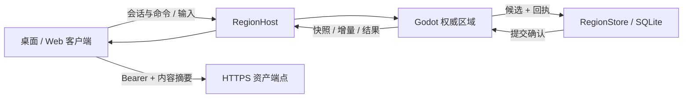

# 现代区域传输与提交合同：FP 0.3

适用：Region Lab 0.5.1。此合同服务于现代 Godot 权威区域；原版 OpenSim 网关继续使用 FP 0.2，二者不是可以直接互换的端点。世界格式 3、领域命令封装 1 保持不变。

## 1. 权威与边界

Godot headless `network/server.gd` 是区域唯一权威，负责生产 WorldService、60 Hz Jolt 物理和状态分发。RegionStore 将候选世界及成功回执写入同一 SQLite 事务。ASP.NET Core RegionHost 只提供静态 Web 文件、授权 HTTPS 资产和 WebSocket 转发。客户端 `LocalWorldView` 无修改或仓储接口，向调用者返回深复制投影。

所有端点仅绑定本机。入口 `/ws`，文本 JSON，`fp_version: "0.3"`。单消息不超过 3 MiB，JSON 最大嵌套 24 层；重复键（含转义等价键）、无效 UTF-8 被拒绝。每连接最多每秒 100 条消息、每帧处理 16 条；待提交队列最多 64 项，慢客户端被断开。初始认证五秒内完成，单连接最长八小时。

## 2. 会话与最小权限

首包为 `{ "fp_version":"0.3", "type":"hello", "token":"…" }`。令牌来自实例配置，解析为 `principal_id`、领域 `actor_id` 和 `role`。后续客户端传入 actor/owner 不构成授权；完整世界覆盖及非白名单操作拒绝。`welcome` 返回区域、持久的 `world_instance_id`、网络世代、角色、Avatar ID 与 20 Hz 分发/60 Hz 物理参数，不返回令牌。

两个演示编辑主体显式共享区域所有者授权；观察者只读，访客独立归属。配置 `private_objects` 按对象 ID 指定允许的主体；组存在不可见成员时整体不投影。资产端点按引用对象权限生成允许列表，不能仅凭已知摘要读取私有资产，也不能通过修改公开对象的资产引用绕过此规则。未被引用的已登记资产允许非观察者使用；完整资产所有权/库存合同属于 V6。

对象级过滤不提供侧信道隔离：服务端物理仍包含所有碰撞体，区域地形和环境为公共状态。该最小测试授权不等价于 OpenSim 完整权限或多租户安全模型。

## 3. 快照、增量与 AOI

每个服务启动生成新的 UUID `world_epoch`；同一个本地实例重启后保持 `world_instance_id`，另建实例则获得不同 ID。每连接 `seq` 单调递增，持久编辑使用世界 `revision`；角色步进另有 `tick`。它们不可互换。初始 `snapshot` 包含 `state`；后续 `delta` 包含可选 `meta` 及对象、组、资产、Avatar 的 `upserts`/`deletes`。对象数据以 UUID 为键。`meta` 包括世界版本、修订、区域、地形和环境。

重复序列忽略；缺失、世代不匹配或校验失败请求 `resync`。只有完整通过校验的下一投影才替换现有状态。连续三次坏快照断开。新快照可跳过序列缺口；删除列表显式移除节点和缓存。客户端通过 `ack.seq` 确认已接受序列；服务器达到 32 个未确认更新后暂停分发，收到确认后从最后已发送状态计算最新差异，防止暂停页面积压且保留删除语义。

`state_hash` 是五类数据各自摘要所组成字典的 SHA256。类别值使用类型标识、排序键和五位小数数字文本；位置精度对应 10 微米。这是跨 JSON 浮点舍入的投影一致性检测，不是 GLB 二进制完整性或命令身份。仅变化类别重新计算摘要；资产字节始终验证精确 SHA256。

默认兴趣半径 96 米，允许 8～128 米，已进入对象有 16 米退出滞后；按解析后中心距离及尺寸球半径判断，组按整体进入/离开。兴趣中心默认跟随权威 Avatar，可由编辑视图指定。地形和环境仍全区域下发，尚未分块。离开释放对应节点与网格缓存，重新进入重新授权下载。

## 4. 命令与回执

命令必须且只能包含：`fp_version,type,world_id,region_id,world_epoch,request_id,trace_id,origin,source_seq,expected_revision,expires_at_ms,operation,payload`。ID 为 UUID；`origin` 为 `desktop/web/test/world_model`，其中 `world_model` 仅 owner 角色可发送；序号每连接递增；过期时间不得超过服务器当前时间后 60 秒，客户端默认 30 秒。区域 ID 当前同时用作 world ID。`world_model` 仍经过同一命令白名单、权限检查、CAS 队列、SQLite 提交与持久回执，不是独立的写入通道。

白名单：CreateObject、UpdateObject、DeleteObject、SculptTerrain、UpdateEnvironment、SetObjectState、GroupObjects、UpdateGroup、DuplicateGroup、UngroupObjects、DeleteGroup、RemoveAsset、UploadAsset。领域规则沿用已有 WorldService。UploadAsset 接收 base64 字节、名称、许可和来源，写入服务端自建临时路径再调用 ImportGlb；客户端不能指定服务端文件路径。

队列严格串行评估。`expected_revision` 匹配才可执行，相同修订的竞争写入只能有一个改变状态。候选与成功回执同事务落库后才发布场景、修订和成功 `result`。`pending` 只表示排队；`result.ok=true` 表示持久提交。无变化的合法操作仍可产生独立持久回执，不伪造世界修订增长。

命令指纹是规范 JSON 的精确 SHA256；规范过程将可精确表达的整数浮点值统一为整数并排序键。相同主体、相同请求 ID 和相同指纹重发返回原结果，不再次执行；更换主体或内容返回 REQUEST_REUSED。成功回执在 schema 3 的 `network_receipts` 表中持久保存；失败回执只在当前世代内缓存。每类上限 10,000，达到后要求维护，当前没有自动清理历史回执。

`query_result` 只接收请求 ID，仅返回本主体结果。重启后查询成功结果可能返回其原世代；这是历史确认，不是新命令。无已知记录返回 RESULT_UNKNOWN，不足以证明从未执行。客户端失去连接后将未确认请求标记为结果未知。

工作线程提交中断时读取持久回执并核对已提交世界；能够确认则返回成功，无法确定则冻结后续编辑并返回 STORAGE_OUTCOME_UNKNOWN。数据库锁定不发布候选，不暂停角色物理。维护恢复不得把未知结果当成确定失败。

## 5. 移动

`input` 只接收递增序号、二维归一化方向、yaw 与 jump；不接收可信位置。服务端步进最大速度 6 m/s，250 ms 未收到输入即停止；采用生产场景碰撞。客户端自身预测、服务端位置校正；远端保留插值样本，延迟 100 ms，最多外推 200 ms。未实现输入历史回滚重演、UDP 丢包模型或高延迟网络优化。

Avatar 为会话瞬态数据；重启在出生点重建，不是持久人物库存。关闭页面不会终止世界服务，后台页面不继续发送移动方向。

## 6. 资产与部署

投影只含可见资产元数据、精确字节数与摘要；GLB 从 `/assets/<sha256>.glb` 使用 Bearer 读取。服务端每次鉴权并核对文件 SHA256；浏览器响应 `private, no-store`，防止换主体后命中授权前的 HTTP 缓存。客户端校验字节数、SHA256 和生产 GLB 规则，最多三次退避重试。缺失模型显示占位体，全部必要碰撞资产完成前禁止漫游；重试成功再构建真实碰撞。

Web 固定 Godot 4.5.1 标准版、单线程发布模板、Jolt、WebGL2；没有 WebGPU。当前固定轻量配置采用顶点光照与 Lambert 模型，关闭动态阴影和 MSAA；保留真实场景、物理与编辑功能。桌面画面配置不受影响。网关发送 COOP `same-origin`、COEP `require-corp`、正确 MIME 和压缩编码。HTML 不缓存；其他静态文件使用 ETag 重验证。构建不携带令牌；新浏览器配置独立测量冷启动，热缓存结果单列。可操作门槛包含必要资产、碰撞投影和完成的渲染帧。

参考：[Godot Web 导出](https://docs.godotengine.org/en/4.5/tutorials/export/exporting_for_web.html)、[WebSocketPeer](https://docs.godotengine.org/en/4.5/classes/class_websocketpeer.html)、[TLSOptions](https://docs.godotengine.org/en/4.5/classes/class_tlsoptions.html)。
