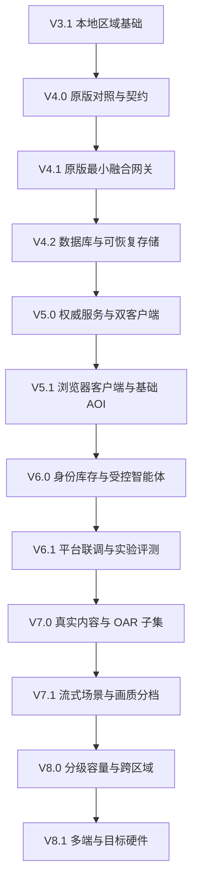

# 世界模型协作平台版本路线与实施计划

更新日期：2026-09-16。当前开发版本：Region Lab V5 / 0.5.1。V5 任务状态与原始证据见 [V5 验收记录](../comparisons/v5-completion.md)。V4.0～V4.2 的实现及逐项验收状态见 [V4 执行记录](v4-progress.md)。

本计划依据老师提供的 [总体报告 A 与客户端方案 B](../references/teacher/2026-09-15/README.md)，将已有区域原型扩展为世界模型的虚拟镜像试验场、现代轻客户端和人机协作平台。目标来源、技术核实及 FP-01～09 对应见 [对齐说明](platform-integration-alignment.md)。V4.2 已提升应用版本至 0.4.2，世界格式 3 与命令封装 1 保持兼容。

## 1. 版本组织与推进原则

继续保留 V4 持久化、V5 服务端同步、V6 身份与智能体的主线，将原版融合网关和浏览器可行性验证纳入 V4；V7 承担内容管线与渲染扩展，V8 承担容量、多端和部署验证。

任务由个人按依赖串行完成。每次选取一个可观察的行为，依次完成合同、实现、异常用例、运行证据和文档。V4 执行记录保留，V5 已形成 [专项实施计划](v5-implementation-plan.md) 和网络实现；V6～V8 的任务边界在进入对应版本时依据实测结果继续拆解。

原材料的 18 个月总路线与 4 个月客户端路线保留为项目层目标。待原版构建、平台接口、场景数据及目标硬件确定后再估算个人工期；不按文档中的并行工程周期直接排个人日程。

## 2. 已交付基础

| 版本 | 已实现能力 | 证据位置 |
| --- | --- | --- |
| V1 / 0.1.0 | 区域、角色、对象、命令与快照 | Git 历史、兼容存档和现有回归 |
| V2 / 0.2.0 | 地形笔刷、拾取、共享地形碰撞、撤销重做 | [V2 说明](../../prototype/docs/releases/v2.md) |
| V3 / 0.3.0 | 六类对象、环境、门灯、可进入展馆、格式 2 | [V3 说明](../../prototype/docs/releases/v3.md) |
| V3.1 / 0.3.1 | 对象组合、静态 GLB、可搬移资产、格式 3、性能基线 | [V3.1 实施记录](v3.1-implementation-plan.md)、[验证记录](../../prototype/docs/verification.md) |

V3.1 保存的检查结果为原生 188 项、界面 66 项通过。V4 已新增原版 FP 网关、受控 Bot、SQLite 仓储、真实历史建筑简化模型及双内核 Web 能力验证；现代区域权威网络服务、在线模型及城市扫描数据仍未交付。43/243 对象性能结果不能外推到 1000 可见实体、5000 区域实体或万级智能体。

## 3. 主线依赖与里程碑

| 里程碑 | 完成条件 |
| --- | --- |
| M0 基线可追溯 | 固定 OpenSim 能独立运行，两部件行为与 Region Lab 对照有数据证据 |
| M1 原版融合贯通 | 模拟平台通过 FP 获取状态、驱动受控 Bot、接收结果，并导出完整操作轨迹 |
| M2 现代双端协作 | 桌面与 Web 共享一个权威区域，重连和服务重启后收敛 |
| M3 真实平台闭环 | 真实世界模型结果回注，人类/Bot 完成任务，专家反馈和实验遥测可导出 |
| M4 规模与部署验收 | 在已声明设备、网络和负载上验证各项指标，发布限制与降级方案 |

M1 使用模拟平台不替代 M3。当前 V3.1 展馆编辑也不替代科学场景验收。

## 4. V4 原版融合基础与可靠存储

### V4.0 基线与契约

**目标**：把原版行为、Web 可行性、数据模型和 FP 草案转化为可执行的验收输入。来源：A §2～4，B §1～2、§8。

主要任务：固定原版源码、工具链和隔离配置；验证两部件建组、根部件、局部变换、复制、解除和重启；完成浏览器最小导出、物理和文件入口预验证；登记一栋真实授权建筑；定义 FP 与存储合同。

交付物：版本锁、配置模板、启动与行为记录、字段对应表、Web 能力报告、建筑来源及通行报告、协议和存储草案。通过条件：结果可在独立目录复现，语义差异逐项分类，未知项有验证任务。WebGPU 可记为固定版本不支持，真实建筑和原版运行未完成时不得标记该里程碑完成。

### V4.1 原版最小融合网关

**目标**：在原版 OpenSim 上获得第一条状态—事件—动作—回执链路。来源：A §3.3、§6.5 第一阶段。

先验证一个受控 Bot 的登录、移动和退出，再开发独立 `FusionRegionModule` 与网关适配。实现 FP-01～05 子集、FP-06 对象变更子集，以及 FP-08/09 最小实验记录。模块通过被验证的 Scene 调度路径操作，不从网络线程任意改场景。

交付物：隔离模块、测试 Bot、模拟平台、协议样例、运行轨迹和失败报告。通过条件：观察到对象变更；Bot 完成可验证动作；重复请求不重复执行；越权、超时和断线结果明确；完整状态与结果可导出。原版实例是该世界的唯一权威。限制：单区域、一个受控 Bot、本地测试身份；完整 SSO、多人容量与真实模型联调后续验收。

### V4.2 存储抽象与数据库

**目标**：区域数据和二进制资产具有明确事务、迁移与恢复规则。来源：A §4、§6.3，B §7。

先形成数据库与服务 ADR，再实现仓储接口、数据库适配、内容寻址资产目录、完整导出包、迁移和恢复命令。对象组合及成员更新为一个事务；校验修订与写入在同一事务中完成；外置资产先验证并发布，再提交数据库引用，失败孤儿按规则回收。

交付物：实体和事务合同、版本化迁移、JSON 兼容适配、数据库实现、备份恢复脚本及故障报告。通过条件：格式 1/2/3 输入迁移后可往返，ID/位姿/地形/状态保留；旧修订拒绝；失败回滚；仅凭导出包在空目录恢复。数据库或服务不可用时保留未保存状态。断电持久性只有实际完成相应故障测试后才能声明。

**V4 详细任务及先后顺序见 [实施计划](v4-implementation-plan.md)。** 数据库上线不等于多人权威状态已完成。

## 5. V5 权威区域服务与现代轻客户端

### V5.0 权威服务和桌面双客户端

**前置**：V4.2 仓储和 V4.1 FP 合同稳定。来源：A §6.3；B §2、§4、§5。

| 任务 | 交付物 | 验收 |
| --- | --- | --- |
| 5.0-01 分离客户端和权威状态 | 区域服务、只读 LocalWorldView、命令客户端 | 关闭所有客户端后，服务仍运行并保存；客户端不能直接提交任意完整世界覆盖服务 |
| 5.0-02 实现 FP 状态同步 | epoch/revision/seq、快照、delta、删除标记 | 两客户端一致；丢失或重复 delta 后能检测并恢复 |
| 5.0-03 处理冲突和幂等 | 服务端排序、命令回执、结果查询 | 同时编辑有明确胜负；重发与重连不重复变更；旧世代拒绝 |
| 5.0-04 同步 Avatar | 输入序列、服务端步进、插值与校正 | 两角色互相可见并受碰撞约束；客户端预测偏差可收敛 |
| 5.0-05 加入最小会话 | 会话认证、主体映射、对象写权限 | 伪造 owner/actor 不改变授权；无效会话不能订阅私有状态或执行变更 |
| 5.0-06 故障和部署验收 | 双进程客户端测试、隔离服务部署文档 | 重启服务后世代处理正确；数据库故障时不返回虚假持久化成功 |

移动输入可预测，门灯和世界编辑等待确认。20Hz 状态发送、100ms 插值、200ms 外推上限作为初始可调参数；必须记录实际稳定性和延迟。服务端持久化修订、角色高频 tick 与网络 seq 分别管理。

**完成条件**：两个桌面客户端在单区域内共同漫游和编辑，断线、冲突、重启后可收敛；提供固定命令和网络轨迹重放。尚不承诺 100 Avatar 或千级容量。

### V5.1 Web 客户端与基础 AOI

**前置**：V4.0 Web 报告和 V5.0 双客户端通过。来源：B §1、§4.3、§5、§8～9。

| 任务 | 交付物 | 验收 |
| --- | --- | --- |
| 5.1-01 固定 Web 构建 | 标准版 GDScript、WebGL2 导出、部署头与版本锁 | 无编辑器缓存的浏览器进入场景；与固定桌面版消费相同协议 |
| 5.1-02 隔离浏览器接口 | 文件选择/下载、指针锁、存储与网络适配 | 取消导入、页面后台、刷新、缓存清除和重新登录有明确行为 |
| 5.1-03 桌面与浏览器联调 | WebSocket 通道、FP 处理、错误状态 UI | 同一对象与门灯状态一致；断线不伪造成功；服务权威不受页面暂停影响 |
| 5.1-04 基础 AOI | 服务端距离过滤、进入/离开记录、可靠删除 | 离开后释放节点；重新进入有完整状态；过滤不泄漏无权访问实体 |
| 5.1-05 资产清单与按需获取 | HTTPS 资产目录、哈希校验、重试和占位显示 | 缺失、损坏、下载中断可恢复；通过场景声明决定阻止进入或使用占位体 |
| 5.1-06 初始性能与 CI | Windows/Web 导出检查、浏览器矩阵、冷/热首包报告 | 至少两种浏览器内核实测；50Mbps、冷缓存首包目标 ≤10 秒，超预算则该项未通过 |

这里的 WebGL2 是固定版本可交付基线。浏览器持久缓存可被清除，服务器存储承担最终保存。WebGPU 研究不阻塞已验证的 WebGL2 路径；任何引擎升级均需重新验证 Jolt、资产、渲染与网络。

## 6. V6 身份 智能体与实验闭环

### V6.0 身份库存与受控智能体

**前置**：V5.1 同步链路可用。来源：A §2.2、§3.2、§5.1；B §5.2、§6.1。

| 任务 | 交付物 | 验收 |
| --- | --- | --- |
| 6.0-01 账户与 Avatar 绑定 | FP-07、会话撤销、人类/Bot/观察者角色 | 人与 Bot 身份可区分；撤销会话立即停止被授权操作 |
| 6.0-02 最小库存 | 库存条目 UUID、资产引用、父容器、归属和使用权限 | 同一资产可由多个库存项引用；复制实例不误改库存身份；重启恢复 |
| 6.0-03 现代区域 Agent 生命周期 | FP-03、agent_ref、能力声明、公开任务状态 | 创建/销毁/重连受控；普通客户端不能任意创建其他主体的 Bot |
| 6.0-04 动作执行器 | MOVE_TO、TURN、INSPECT、受支持交互、取消与截止时间 | 到达依据末态与碰撞；门关闭、路径阻断、目标消失和超时给出终态 |
| 6.0-05 人工接管与动作审计 | 暂停、取消、能力收回、trace 关联 | 用户接管后旧计划不能继续写入；重复调用不重复执行 |
| 6.0-06 受控策略和模型适配 | 确定性策略基线、可替换在线模型调用接口 | 同一任务既能用固定策略回归，也能在有真实模型配置时运行；生成内容只转为校验过的命令 |

**完成条件**：一名人类和一个现代区域 Bot 共同进入建筑、查询对象、操作门灯并返回结果；权限拒绝、任务中断和模型失败均有报告。完整 LSL/OSSL、任意代码执行和跨域账户互认不在本子版本内。外部 SSO 在获得真实接口后验收，测试身份通过不代表 SSO 已完成。

### V6.1 真实平台联调与实验评测

**前置**：实际平台接口、身份约定、科学数据与授权就绪。来源：A §4～5；B §6.2、§8 的回放 CI。

| 任务 | 交付物 | 验收 |
| --- | --- | --- |
| 6.1-01 世界模型数据映射 | 观测/预测时间、坐标/高程基准、单位、模型版本 | 过期、未知单位、越界和版本不兼容输入明确拒绝；映射可复核 |
| 6.1-02 场景回注 | FP-06 批次、来源、实验分支、回注结果 | 原始预测与采用后的场景状态可对照；同批次不重复应用 |
| 6.1-03 首个科学任务 | 洪涝水位/道路阻断候选场景、人类和 Bot 任务 | 外部结果改变通行策略；完成观察、执行、失败处理和反馈闭环 |
| 6.1-04 专家协作标注 | 标注主体、目标、时间、问题类型与证据引用 | 标注同步、修改权限正确，并关联原始预测及实验 |
| 6.1-05 实验控制和记录 | FP-08/09、初始快照、事件日志、资产清单、版本和随机源 | 创建/暂停/继续/终止/分支可验证；中断后文件完整性可检查 |
| 6.1-06 回放与比较 | 权威状态回放器、差异报告、反事实对比、CI 数据集 | 指定状态字段按日志回放一致；重新仿真按声明容差；所有动作都有回执或结果未知记录 |

**完成条件**：真实平台完成至少一个科学场景的输入—回注—人机任务—专家反馈—遥测导出。模拟数据只计工程检查。神经世界模型训练、机理求解与持续学习由外部平台负责，本项目提供可追溯输入输出和评测载体。

## 7. V7 真实内容与客户端规模基础

### V7.0 内容管线与 OAR 子集

**前置**：V4 真实建筑样本、V6 语义与权限合同。来源：A §6.3～6.4；B §6～7。

| 任务 | 交付与验收 |
| --- | --- |
| 7.0-01 定义内容加工合同 | 原始资产、转换工具版本、单位、坐标、许可、运行时衍生物和摘要完整登记；同内容去重 |
| 7.0-02 建立 OAR 检查与导入 | 先只读清单，再支持固定地形与静态 Prim/linkset 子集；根、局部变换、材质和 ID 映射逐项对照 |
| 7.0-03 处理不支持内容 | 脚本、复杂 Prim、纹理/网格编码、库存分别报告；拒绝或经明确策略占位，不能静默丢失 |
| 7.0-04 扩展真实场景入口 | 小片区建筑与道路可通行；CAD/BIM 或摄影测量仅选择一条有真实输入的转换路径起步 |
| 7.0-05 引入运行时资产档位 | 按需求验证 PBR 通道、KTX2、网格压缩和骨骼 Avatar；逐类锁定子集、资源预算与失败行为 |

**完成条件**：一个有来源和授权的小片区及一个受支持 OAR 样本导入成功，独立导出恢复，碰撞与对象组语义可对照。OpenUSD 作为制作/交换候选，运行时使用声明支持的 glTF 衍生格式；不是把 USD 任意节点直接当可执行场景。IAR 库存迁移在最小库存稳定后另验。

### V7.1 分块加载 画质与协作扩展

**前置**：V7.0 内容清单和可复现固定场景。来源：B §3、§4.3、§6.2、§7～9。

| 任务 | 交付与验收 |
| --- | --- |
| 7.1-01 优化资源与实例 | 共享 Mesh/Material，按相同网格材质评估 MultiMesh；保留独立拾取、权限和碰撞语义 |
| 7.1-02 分块地形与 AOI | 地形分块更新、LOD/HLOD、加载/卸载与资产 LRU；边界碰撞、节点清理和返回原区块正确 |
| 7.1-03 三档画质 | 在实际后端支持范围内设置分辨率、阴影、灯光、贴图和后处理；画质降级不改变服务器世界数据 |
| 7.1-04 资产传输与更新 | 哈希清单、分包、下载恢复、旧版本回滚；清单不匹配与超预算有可见结果 |
| 7.1-05 协作表现 | 共享镜头、公开任务标签、WebRTC/SFU 语音试点；拒绝麦克风权限时文字与任务仍可用 |
| 7.1-06 预算回归 | 固定低端设备测 720p30，固定主流设备测 1080p60；记录冷启动、峰值内存、渲染与网络负载 |

**完成条件**：明确设备上的画质档达到第 10 节规定预算，长时间进出 AOI 后内存与节点数不持续增长。WebGPU 与 GPU 剔除只有在独立验证通过后才作为档位能力；先以已支持后端完成对应效果和预算。

## 8. V8 容量 跨区域与部署验证

### V8.0 分级容量与跨区域

逐级推进“2 客户端→10 活跃参与者→100 Avatar/1000 可见实体→5000 区域实体”，每级先验证正确性、回执完整性和资源稳定，再提升负载。分别报告静态对象、活动 Bot、Avatar、区域总实体、AOI 实体和可见实体；数量不能互相替代。

| 任务 | 交付与验收 |
| --- | --- |
| 8.0-01 建立分级负载 | 固定静态/活动实体比例、Avatar 动画与 Bot 策略；每级保留资源、错误和回执记录，前一级未通过不提高对外容量声明 |
| 8.0-02 优化同步路径 | 空间索引、AOI、优先级、背压与必要的二进制 delta；正确性与原协议样例等价，量化误差低于声明上限 |
| 8.0-03 评估新传输 | 同场景对比 WebSocket 和 WebTransport/QUIC 的时延、带宽、重连及运维；降级后权限、顺序和回执语义不变 |
| 8.0-04 验证区域交接 | 两个相邻区域交接角色及受支持状态；任何时刻只有一个权威归属，失败可返回原区或恢复会话 |
| 8.0-05 验证容量与故障 | 60 分钟稳定负载、服务重启、数据库/资产服务中断与恢复；错误率、尾延迟、资源增长和数据损失范围有报告 |
| 8.0-06 完成第二科学场景 | 在首个洪涝候选场景之外增加交通调度/道路封闭绕行；两套真实平台输入分别完成回注、人机任务、反馈与遥测评测，复用同一 FP 合同 |

第二科学场景的顺序随老师确认的业务优先级调整。两个场景必须分别有数据、授权和评价问题，不能以同一演示更换名称代替独立验证。

**完成条件**：选定目标级别下，状态、回执、帧时间和带宽达到约定预算；60 分钟负载与故障测试无持续资源增长，产生可重放原始记录。万级智能体是后续集群目标，需额外硬件和负载设计；未达到时保留未验收状态。

### V8.1 多端与国产硬件

| 任务 | 交付与验收 |
| --- | --- |
| 8.1-01 Linux 部署 | 固定系统与依赖，服务端和桌面客户端分别构建；协议、存储、资产与回放回归通过 |
| 8.1-02 Android 接入 | 触控与界面、资源预算、后台/前台恢复；在指定设备完成同一任务并输出帧时间与内存报告 |
| 8.1-03 OpenXR 验证 | 指定头显、运行时、控制器和交互范围；输入、移动方式、帧时间和舒适性独立验收 |
| 8.1-04 国产硬件适配 | 按具体设备验证驱动、渲染、CPU/可选 GPU 物理、服务与模型适配；保留性能和数值差异报告 |
| 8.1-05 部署与运维交付 | 固定安装包、配置、健康检查、日志、备份、迁移与回滚；在目标环境从空目录完成恢复 |

依次验证 Windows/Web 已有基线、Linux 服务及客户端、Android、OpenXR。每个平台固定 OS、驱动、引擎、设备和功能矩阵，复用协议及记录回放测试。

国产适配按具体 CPU/GPU/加速器型号展开，分别测试服务进程、渲染、物理和推理适配。模型推理服务可远程提供；模型算子支持不能代替图形驱动或 GPU 物理支持。部署文档包含依赖、数据迁移、日志、健康检查、备份和回滚。

**完成条件**：在选定目标硬件运行同一场景及协议回归，报告精度、性能、故障和不支持项。尚未取得的设备不得记为已支持。

## 9. 条件研究与兼容专题

| 专题 | 进入条件 | 独立验收与退出策略 |
| --- | --- | --- |
| WebGPU | 可用固定引擎/后端版本、浏览器和维护预算 | 实际导出、场景/物理/性能回归；若未通过，保留 WebGL2 与原生桌面交付 |
| GPU 物理 | CPU 物理热点实测、明确任务收益与目标设备 | 固定场景精度和吞吐对比、故障恢复；保留 CPU 回归与部署路径 |
| LLUDP/CAPS Viewer 兼容 | 存量 Viewer 使用场景及消息范围确定 | 登录、移动、对象、资产逐协议测试；原版运行环境继续服务未迁移内容 |
| LSL/OSSL 兼容 | 存量脚本样本和必要函数集合确定 | 分开测试编译、事件、计时、状态、权限；不能以语法转译声称完整兼容 |
| IAR 与完整库存迁移 | 最小库存、权限及授权样本就绪 | 条目、目录、资源引用、归属与不可迁移信息有报告 |
| Hypergrid/联邦 | 多区域交接和身份/资源信任规则完成 | 跨域授权、撤销、失败回退与资源访问；不同于同集群跨区域移动 |
| 云渲染和像素流 | 目标用户硬件不足且带宽、GPU 成本可测 | 1080p60、时延、码率、并发/卡与成本实测；不替代本地 Web 渲染预算 |
| 微服务与事件总线 | 进程负载、故障隔离或平台对接证明有必要 | 对比单服务和拆分后的运维、时延、幂等与恢复；Kafka/NATS、时序库等按 ADR 固定 |

以上内容保留为老师报告的中长期目标，不能因为列入表格就认为已排定工期或自动接受全部候选技术。

## 10. 指标口径与发布门槛

下表数值来自 A §6.6 与 B §9，均为目标。V3.1 现有短时测量不满足这些容量与网络验收条件。

| 指标 | 来源目标 | 落地口径与阶段 |
| --- | --- | --- |
| 可交互首包 | ≤10 秒，50Mbps | V5.1 起测；冷缓存从导航到认证、必要资产与首个可操作帧完成；另报热缓存，至少 5 次独立加载 |
| 低档与主流画质 | 720p30 / 1080p60 | V7.1；固定硬件、场景、分辨率和供电，预热 60 秒后采样 ≥5 分钟、≥3 次；P95 帧时间分别 ≤33.3/16.7ms，另报卡顿 |
| Web 内存 | WASM 堆 ≤1.5GB，资产 LRU ≤600MB | V7.1；同时报告 JS 堆、解码暂存、资源与可获得的 GPU 指标；LRU 不等于全部进程内存 |
| CPU 帧预算 | 逻辑 ≤4ms、渲染提交 ≤3ms | V7.1；固定采样工具和口径，分别报告主线程与工作线程开销 |
| 状态下行 | ≤1.5Mbps、20Hz 满 AOI | V8.0；明确 AOI 组成、活动比例、编码和是否含协议开销；不能只测静止场景 |
| 状态同步 | 同城 P99 <100ms | V5 起测、V8 验收；权威变更产生到客户端应用，记录时钟误差与原始样本 |
| 本地视觉反馈 | ≤120ms | V5 起测；输入到本地画面反应，单列远程观察延迟与插值窗口 |
| 动作回执 | P99 <200ms | 即时动作完成或长动作受理分别统计；长动作另报执行耗时、截止时间与末态误差 |
| 重连 | 目标 ≤3 秒 | V5.1 起测；链路恢复到认证且状态可操作，区别网络仍不可用和资产冷启动；不限定必须 0-RTT |
| 客户端可见规模 | 100 Avatar / 1000 实体 | V8.0；固定骨骼、动画、材质、活动率、AOI 与遮挡，帧时间和带宽同时验收 |
| 区域与集群规模 | ≥5000 区域实体、万级智能体目标 | V8 后续容量级别；分别说明活动率、区域数和节点数，按 60 分钟稳定负载及故障检查验收 |
| 实验复现 | 原文 100% | V6.1 定义可回放字段并逐次比较；重新仿真采用声明容差和任务指标，不承诺任意物理轨迹逐位相同 |
| 云算力 | 2 路/卡 1080p60、利用率 ≥65% | 条件研究；固定 GPU、编码、画质与负载，分别报告渲染和推理；不能以高利用率替代服务质量 |

网络指标测试至少覆盖正常网络、受控抖动/丢包、断线与服务重启。测量前登记拓扑、RTT、带宽、设备、场景摘要、持续时间和失败率；P99 至少保留 10,000 个有效样本及所有失败记录，样本不足时只作探索结果。原始报告与可复现命令随版本保存。

## 11. 统一完成标准与最近行动

每个子版本发布前必须具备：明确的支持范围、版本化数据与协议、合法和非法输入案例、重启或故障证据、独立目录复现、适用的界面截图以及部署/回滚说明。测试在独立路径执行；现有存档迁移必须可验证，不能覆盖用户数据。

最近按以下顺序推进：

1. 完成 V4.0 固定 OpenSim 独立构建和两部件行为对照。
2. 形成 Web 导出能力报告、真实建筑记录、FP 和存储草案。
3. 完成 V4.1 单 Bot 与 Region 模块的最小 FP 闭环。
4. 依据实测语义和平台部署条件完成 V4.2 ADR 与数据库实现。

首个科学场景、真实平台接口和目标硬件等外部输入登记在 [对齐说明第 6 节](platform-integration-alignment.md#6-外部依赖与决策登记)。外部输入缺失时继续可独立执行的合同、模拟端与测试工作，对应真实联调里程碑保持未完成。
