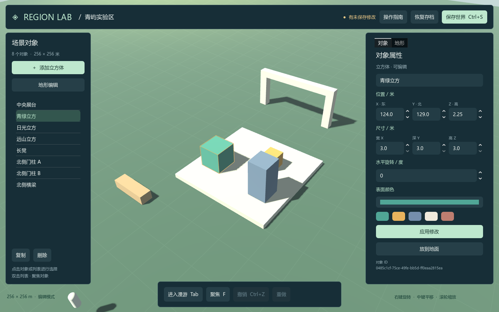
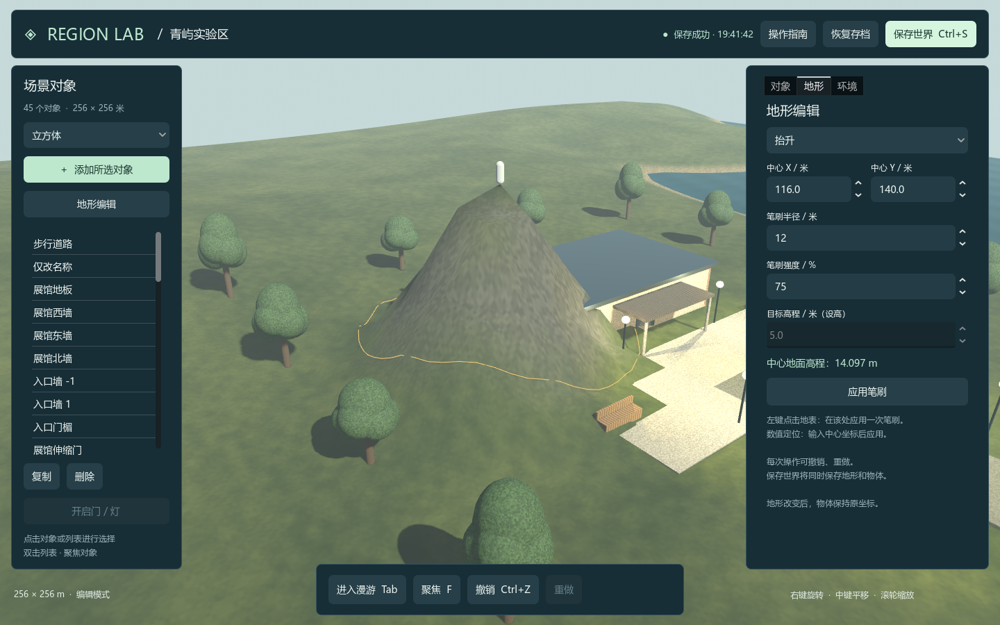

# Region Lab V5 使用说明

版本：0.5.1。本文主要描述保留的 Windows x64 离线编辑器。**V5 网络共享区域、双桌面客户端和 Web 客户端请从 [网络运行指南](docs/network-quickstart.md) 开始。** 世界格式仍为 3，本地命令版本仍为 1，现代网络协议为 FP 0.3，数据库 schema 为 3。

V4 新增可选 SQLite 仓储，支持提交冲突检查、独立资产、备份导出和恢复；默认 JSON 保存路径保持兼容。原版网关位于 [integration](../integration/README.md)，数据库部署见 [services](../services/README.md)，阶段证据见 [V4 验收](../docs/comparisons/v4-completion.md)。

Region Lab 是基于 Godot 的单区域原型，支持对象组合、静态 GLB、六类内置对象、程序材质、地形、环境、门灯交互和角色漫游。新世界提供庭院、湖岸及可进入的展馆。区域尺寸为 256×256 米；离线模式为本机单用户，网络模式由独立权威服务和多个只读投影客户端组成。

Region Lab 是世界模型与智能体协作平台的区域基础。总体定位见 [项目 README](../README.md)，原始目标与技术核实见 [对齐说明](../docs/plans/platform-integration-alignment.md)。原版 FP 0.2 网关和现代 FP 0.3 服务分别运行；尚未接入外部智能体平台。网络验收与性能状态见 [V5 记录](../docs/comparisons/v5-completion.md)。

## 1. 环境要求

| 项目 | 要求 |
| --- | --- |
| 操作系统 | Windows x64；已验证 Windows 11 10.0.26200，Windows 10 尚未实测 |
| 图形 | 支持 OpenGL 3.3 的显卡和正常驱动；采用 Compatibility 渲染器 |
| 引擎 | Godot 4.5.1 标准版，版本号 `4.5.1.stable.official.f62fdbde1` |
| 物理 | 引擎内置 Jolt，无独立安装项 |
| 命令环境 | Windows PowerShell 5.1；CMD 入口兼容从 PowerShell 7 调用 |
| 网络 | 在线安装时下载官方引擎包，约 77 MB；安装后可离线运行 |
| 可选工具 | Git，用于克隆和更新代码 |

版本及 SHA512 固定在 [engine.lock.json](engine.lock.json)。默认 JSON 模式不需要 .NET SDK、Python、C++ 编译器、数据库服务、模型权重或 API Key。SQLite 模式另需 .NET 8 运行时和已构建的 RegionStore；从源码构建该工具需要 SDK 8.0.424。当前桌面直接运行工程，不需要导出模板。

## 2. 安装

### 2.1 获取代码

```powershell
git clone --branch codex/region-lab-v5 https://github.com/StarryLiu1122/OpenSim.git
cd OpenSim\prototype
```

也可在 GitHub 下载 `codex/region-lab-v5` 分支 ZIP 并解压。已有仓库先保存本地修改，再更新该分支。V3.1 固定实现提交为 `1af88966496561787e79bb387083de998dae4a81`；需要复现该版时使用独立目录检出此提交。

### 2.2 安装引擎

```powershell
.\Install.cmd
```

脚本从官方发行地址下载压缩包，验证归档布局、压缩包及可执行文件的 SHA512，安装至 `.tools/godot-4.5.1/`。安装仅写入项目目录，不修改系统 PATH 或系统执行策略。已安装且校验通过时直接复用。

离线安装：

```powershell
powershell.exe -NoProfile -ExecutionPolicy Bypass -File .\tools\Install-Godot.ps1 -ArchivePath "D:\Downloads\Godot_v4.5.1-stable_win64.exe.zip"
```

压缩包必须来自 [Godot 4.5.1 官方发行页](https://github.com/godotengine/godot-builds/releases/tag/4.5.1-stable)，文件名为 `Godot_v4.5.1-stable_win64.exe.zip`。

## 3. 启动

```powershell
.\Start.cmd
```

文件管理器中可双击 `Start.cmd`。以下参数用于指定世界、引擎或编辑器：

```powershell
.\Start.cmd -WorldFile "D:\RegionLabData\demo.json"
.\Start.cmd -Godot "D:\Godot\Godot_v4.5.1-stable_win64_console.exe"
.\Start.cmd -Editor
```

也可通过当前终端的 `GODOT_EXE` 指定引擎。使用新的 `-WorldFile` 路径将创建一份独立演示世界；首次保存前只存在于内存。

启动检查可输出一张画面后自动退出，不自动保存世界：

```powershell
.\Start.cmd -WorldFile "$PWD\runtime\launch-check.json" -Screenshot "$PWD\test-results\launch.png"
```

### 3.1 可选数据库模式

完成 [RegionStore 构建](../services/README.md) 后，在此目录启动：

```powershell
.\Start.cmd -Database "D:\RegionLabData\v4-world" -StoreExecutable "D:\RegionStore\RegionStore.exe"
```

首次为空库时显示演示区域，保存后建立持久记录。再次传入相同目录恢复；不能同时指定 `-WorldFile` 和 `-Database`。已有 V3.1 存档请通过管理工具导入到新数据库，原文件保留。保存冲突会保留未保存标记；先备份编辑，再恢复存档处理冲突。使用指南包含迁移、备份、恢复和回滚步骤。

## 4. 物体与角色操作

左侧为对象列表，右侧“对象”页显示所选对象属性。属性输入完成后，点击“应用修改”提交至世界状态。仅输入但未应用的数值不会被保存。

| 操作 | 入口 |
| --- | --- |
| 创建、复制、删除 | 左侧按钮；复制 Ctrl+D，删除 Delete |
| 选择类型 | 左侧下拉框：方块、圆柱、球、伸缩门、树木、路灯 |
| 门灯交互 | 编辑模式选择对象后点击开启/关闭；漫游模式对准 4 米内的门框或路灯，按 E |
| 选择对象 | 单击场景物体或列表条目 |
| 编辑属性 | 名称、位置、尺寸、水平旋转、颜色和材质，编辑后应用 |
| 聚焦 | F 或双击列表 |
| 编辑视角 | 右键旋转、中键平移、滚轮缩放 |
| 漫游 | Tab 进入，WASD 移动，空格跳跃，Shift 加速，Esc 返回 |
| 撤销 / 重做 | Ctrl+Z / Ctrl+Y，或底部按钮 |
| 保存 / 恢复 | Ctrl+S / Ctrl+O，或顶部按钮 |

坐标单位为米，X 向东、Y 向北、Z 为高度。物体每轴尺寸为 0.2–32 米，旋转后的完整水平范围必须位于区域内。

### 4.1 首次体验

1. 使用一个新的存档路径启动，例如 `Start.cmd -WorldFile "$PWD\runtime\v31-demo.json"`。已有 V1/V2/V3 存档将保留原场景，不自动替换为展馆。
2. Tab 进入漫游，沿道路向前走到展馆入口。漫游时隐藏两侧编辑面板。
3. 在 4 米内对准门或门框，按 E 开门，继续向前进入室内。打开后门洞中央为空，应对准门框关闭。
4. Esc 返回编辑。在“环境”页设置 20 时，点击“应用环境设置”，观察路灯与夜景。
5. 保存世界，关闭后用同一路径重新启动，核对环境与门灯状态。

新建展馆的 15 个部件已组成一组，地板为根。选择任意成员后进入“组合”页，可整体移动、旋转、统一缩放或复制；门灯仍可分别操作。已有存档保持原有部件关系。

### 4.2 区域环境

| 设置 | 范围与作用 |
| --- | --- |
| 太阳时刻 | 0–24；6 时日出、12 时正午、18 时日落；固定时刻，不自动推进，也不计算真实地理日照 |
| 水位 | -40–80 米；整个区域共用水平水面 |
| 水面开关 | 控制水面显示；地形与物体不随水位变化 |
| 雾密度 | 0–0.02，0 关闭 |
| 地形网格 | 编辑辅助线，可按需开启 |

环境操作与物体、地形共用撤销和重做。水面为视觉效果，当前没有游泳、浮力、潮汐或水流。树木仅树干参与碰撞；叶冠不阻挡角色。门使用内置伸缩状态，不执行外部脚本。



### 4.3 组合编辑

1. 在左侧列表按 Ctrl 多选至少两个未组合部件，最后选择的对象作为根，点击“组合”。
2. 在“组合”页修改名称、组位置、水平旋转或统一缩放，点击“应用组合变换”。
3. 填写副本偏移，点击“复制整个组合”；新副本拥有独立 ID 和交互状态。
4. “解除组合”保留部件当前世界位置；“删除整个组合”删除所有成员，均可撤销。

组倍率为 0.1–10，但成员投影后仍须满足每轴 0.2–32 米及区域边界。薄地板可能限制整体缩小。根部件的位置和旋转在“组合”页编辑，子部件仍可在“对象”页按世界坐标调整。Ctrl+D 只复制当前单个部件为独立对象。

### 4.4 导入 GLB

1. 打开右侧“资产”页，点击“选择 GLB 文件”，或输入文件路径。
2. 填写名称、许可和作者来源。示例位于 `fixtures/meshes/`，可填写 `CC0-1.0` 和 `Region Lab contributors`。
3. 点击“导入资产”。成功后左侧类型列表选中该模型，点击“添加所选对象”放置实例。
4. 在对象页调整位置、尺寸、角度和整体颜色；同一模型可多次放置。其 PBR 表面来自原文件，不能切换内置程序材质。
5. 保存后模型内容内嵌在存档中，搬移存档无须携带源 GLB。没有实例引用的资产可在资产页移除，移除可撤销。

支持范围：静态 GLB 2.0、单文件不超过 2 MiB、不超过 20,000 三角形（包括碰撞代理）、每轴尺寸 0.2–32 米、不透明材质、内嵌 PNG 基础色贴图。动画、外部贴图、压缩扩展等会被拒绝，完整限制及导出要求见 [组合与资产规范](docs/groups-and-assets.md)。快照整体上限仍为 8 MiB。

示例建筑使用保留门洞的碰撞代理，可直接进入内部；树的代理只包括树干。三个样本用于功能验证，不是实景扫描资产。导入 GLB 内部的节点不可单独编辑；需要可动门时，另外添加内置门并与建筑组合。

## 5. 地形编辑

点击左侧“地形编辑”，或切换右侧“地形”页。

1. 选择笔刷类型，设置半径和强度。设高模式还需填写目标高程。
2. 在地表单击应用一次笔刷；也可填写中心 X、Y 后点击“应用笔刷”。黄色轮廓表示操作范围。
3. 检查地形结果，按需撤销或重做。
4. 点击“保存世界”。重新启动或恢复存档后，编辑后的地形与物体一起恢复。

| 笔刷 | 效果 |
| --- | --- |
| 抬升 | 增加高程；中心单次最大增量为 8 米乘以强度 |
| 降低 | 减小高程；中心单次最大减量为 8 米乘以强度 |
| 设高 | 按强度向目标高程混合；100% 强度时中心达到目标值 |
| 平滑 | 按强度向原高度场的 3×3 邻域均值混合 |

笔刷半径为 4–32 米，强度为 5%–100%，高程范围为 -40–80 米。作用随距中心距离增加而衰减，边界外采样不参与操作。地形采用 4 米采样间距，因此小范围编辑呈现网格分辨率限制。

**每次单击是一条编辑命令，当前不支持按住鼠标连续涂抹。** 笔刷仅修改地形；物体保持原坐标。抬升地形可能遮挡已有物体，可在“对象”页调整位置或使用“放到地面”。地形抬升到角色脚下时，程序将角色抬至地面上方，并保留水平位置。



## 6. 保存与版本兼容

默认存档为 `%APPDATA%\OpenSimRegionLab\worlds\default.json`。界面“操作指南”显示实际路径；`-WorldFile` 可指定独立文件。

| 文件 | 用途 |
| --- | --- |
| `*.json` | 当前世界 |
| `*.json.bak` | 上一次有效世界 |
| `*.json.tmp`、`*.json.bak.tmp` | 写入期间的中间文件 |

保存流程包括数据校验、临时写入、回读验证、有效备份更新和主文件替换。主存档无效时尝试备份；恢复备份后界面提示检查并保存。两份文件均无效时保留当前内存世界并报告错误。

V4.2 继续使用世界格式版本 3，可读取 V1/V2 的格式 1 和 V3 的格式 2。先验证旧数据，再在内存中补齐组与资产相关字段，标记为待保存；读取时不改写原文件。首次保存升级结果时，原格式保留在 .bak。旧版程序不能读取格式 3；返回旧版应使用升级前副本。不要让两个程序实例写入同一世界文件，当前文件存储不提供跨进程事务。

保存内容包括区域、地形、环境、组合、资产目录及 GLB 内容、物体材质和门灯状态。编辑相机、角色实时位置、选择状态和撤销历史不持久化；角色重新启动时位于区域起点。撤销或重做后的世界按已修改状态处理，保存后清除标记。

## 7. 测试与自动化

数据、物理、兼容性、跨进程及批处理测试：

```powershell
powershell.exe -NoProfile -ExecutionPolicy Bypass -File .\tools\Test-RegionLab.ps1
```

增加界面事件与渲染测试：

```powershell
powershell.exe -NoProfile -ExecutionPolicy Bypass -File .\tools\Test-RegionLab.ps1 -Visual
```

每次运行输出至独立的 `test-results/run-.../`，包括汇总 JSON、各项检查、引擎日志和截图。测试不使用默认用户存档。当前结果见 [验证记录](docs/verification.md)。

离线地形命令样例：

```powershell
$engine = ".\.tools\godot-4.5.1\Godot_v4.5.1-stable_win64_console.exe"
& $engine --headless --path .\godot --script res://tools/world_cli.gd -- `
  "--world-file=$PWD\runtime\terrain-demo.json" `
  "--commands=$PWD\fixtures\sculpt-and-save.commands.json" `
  "--output=$PWD\runtime\terrain-report.json"
.\Start.cmd -WorldFile "$PWD\runtime\terrain-demo.json"
```

批处理应在图形程序关闭后执行。创建物体样例另见 [create-and-save.commands.json](fixtures/create-and-save.commands.json)，环境与开门样例见 [environment-and-door.commands.json](fixtures/environment-and-door.commands.json)，命令语义见 [接口文档](docs/architecture-and-api.md)。

固定场景性能测量：

```powershell
powershell.exe -NoProfile -ExecutionPolicy Bypass -File .\tools\Measure-RegionLab.ps1
```

需要图形会话，输出至独立 `test-results/benchmark-.../`。报告包含实际硬件、场景设置、帧间隔及资源监测，解释见 [性能基线](docs/performance.md)。

## 8. 常见故障

| 现象 | 处理 |
| --- | --- |
| 模型导入被拒绝 | 查看弹窗具体原因；确认米制、静态 GLB、内嵌 PNG、无扩展及动画；按规范简化后重试 |
| 组合变换被拒绝 | 检查所有成员的尺寸和区域边界，尤其薄地板；整组操作失败不会提交部分成员 |
| 找不到引擎或版本不符 | 运行 `Install.cmd`，或指定固定版本的 console 可执行文件 |
| 下载失败或校验失败 | 从官方发行页下载同名压缩包后离线安装；保留校验检查 |
| 黑屏、图形初始化失败 | 检查 OpenGL 3.3 驱动；无图形会话可先运行非视觉测试 |
| 中文显示方框 | 界面使用系统中文字体，Windows 优先 Microsoft YaHei；未随仓库分发字体 |
| 属性变化未保存 | 先点击“应用修改”或“应用笔刷”，再保存世界 |
| 地形操作没有变化 | 检查高程上限、笔刷模式、强度与采样分辨率；无变化操作不增加历史 |
| 保存时报告外部修改 | 从磁盘恢复后再编辑，或为另一实例指定不同存档 |

## 9. 相关文档

[文档库](../docs/README.md) · [架构与接口](docs/architecture-and-api.md) · [数据对应](docs/opensim-data-mapping.md) · [技术选型](docs/engine-decision.md) · [V3.1 版本说明](docs/releases/v3.1.md) · [后续计划](../docs/plans/stage-one-rebuild-plan.md) · [V4 实施计划](../docs/plans/v4-implementation-plan.md)
