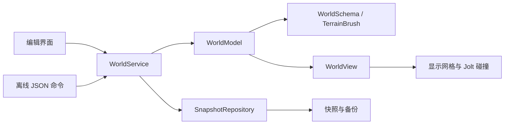

# 架构与接口规范

适用版本：Region Lab 0.2.0。世界格式版本：1；命令协议版本：1。

## 1. 模块职责



| 模块 | 职责 | 主要文件 |
| --- | --- | --- |
| WorldSchema | 世界格式、字段边界、标识和完整性校验 | `godot/domain/world_schema.gd` |
| TerrainBrush | 单次笔刷计算，生成候选高度场 | `godot/domain/terrain_brush.gd` |
| WorldModel | 数据副本、归属校验、原子状态替换和修订 | `godot/domain/world_model.gd` |
| WorldService | 命令封装、重复请求、历史、保存恢复 | `godot/domain/world_service.gd` |
| SnapshotRepository | 文件封装、校验、备份与发布 | `godot/adapters/snapshot_repository.gd` |
| WorldView | 坐标转换、显示网格、碰撞体与拾取 | `godot/adapters/world_view.gd` |
| Client | 物体与地形面板、角色输入和相机 | `godot/client/`、`godot/main.gd` |

世界记录不包含引擎节点。Model 在候选副本上完成校验，通过后替换状态；输入、查询和历史使用独立副本。UI 和离线工具的世界修改统一经过 Service。相机操作不修改持久化世界。

## 2. 世界格式

根字段固定为 `schema_version`、`revision`、`region`、`terrain`、`assets`、`objects`。

| 字段 | 约束 |
| --- | --- |
| `schema_version` | 当前为 1，未知版本拒绝读取 |
| `revision` | 0–1,000,000,000 的整数 |
| `region` | `id/name/size/spawn/owner_id`；尺寸当前固定 256×256 米 |
| `terrain` | `columns/rows/spacing/heights`；覆盖范围必须与区域一致，高程 -40–80 米 |
| `assets` | 当前仅一个固定的 `builtin://unit-box` 描述 |
| `objects` | 最多 500 个单部件方块；ID 唯一，变换和归属须合法 |

未知字段、非有限数值、非法资产引用、未归一化旋转和越界形状均被拒绝。500 是输入上限，尚未作为已验证的性能容量。

坐标、字段及 OpenSim 对应关系见 [数据模型说明](opensim-data-mapping.md)。V2 新增地形命令和重做，不增加存档字段；应用版本与数据版本分别管理。

## 3. 命令封装

进程内入口为 `WorldService.dispatch(command)`：

```json
{
  "api_version": 1,
  "request_id": "66666666-6666-4666-8666-666666666666",
  "operation": "SculptTerrain",
  "expected_revision": 0,
  "payload": {
    "mode": "raise",
    "center": [116, 140],
    "radius": 12,
    "strength": 0.5,
    "target_height": 5
  }
}
```

`expected_revision` 必须与当前修订一致，包括查询操作。进程内便捷方法 `request(operation, payload)` 自动提供新请求 ID 和当前修订。当前没有网络传输、认证或远程查询握手。

| 操作 | payload | 结果或状态变化 |
| --- | --- | --- |
| `GetRegionSnapshot` | `{}` | 返回 `payload.world` 独立副本 |
| `CreateObject` | `{"object": 完整物体}` | 创建物体，校验归属、资产及变换 |
| `UpdateObject` | `{"id": "UUID", "patch": 修改字段}` | 可改 name、position、rotation、size、color |
| `DeleteObject` | `{"id": "UUID"}` | 删除当前身份拥有的物体 |
| `SculptTerrain` | 笔刷参数，见下节 | 修改区域归属允许的高度场 |
| `Undo` | `{}` | 撤销最近一次有效编辑 |
| `Redo` | `{}` | 重做最近撤销的编辑 |
| `SaveRegion` | `{}` | 保存当前世界，成功后清除未保存标记 |
| `LoadRegion` | `{}` | 验证并恢复世界，清空历史及请求缓存 |

完整物体样例见 [create-and-save.commands.json](../fixtures/create-and-save.commands.json)。复制和地面放置由客户端组织为创建或修改命令，不单设持久化操作。

结果字段固定为：

```json
{
  "api_version": 1,
  "ok": false,
  "operation": "SculptTerrain",
  "request_id": "66666666-6666-4666-8666-666666666666",
  "revision": 1,
  "payload": {},
  "warnings": [],
  "errors": [{"code": "REVISION_CONFLICT", "message": "World changed; query the current revision and retry."}]
}
```

常见错误代码为 `INVALID_COMMAND`、`INVALID_PAYLOAD`、`REQUEST_REUSED`、`REVISION_CONFLICT`、`MUTATION_REJECTED`、`SAVE_FAILED`、`LOAD_FAILED`、`NOTHING_TO_UNDO`、`NOTHING_TO_REDO`、`HISTORY_REJECTED` 和 `UNKNOWN_OPERATION`。详细校验原因通过 `message` 返回。

## 4. 地形笔刷契约

`SculptTerrain` 必须包含以下五个字段：

| 字段 | 范围与含义 |
| --- | --- |
| `mode` | `raise`、`lower`、`flatten`、`smooth` |
| `center` | `[X,Y]`，各分量 0–256 米 |
| `radius` | 4–32 米 |
| `strength` | 0.05–1.0，UI 显示为百分比 |
| `target_height` | -40–80 米；仅 flatten 使用，其它模式保留字段但不使用 |

对半径内采样点，设距中心距离为 `d`，半径为 `r`，强度为 `s`：

```text
t = 1 - d / r
w = s × t² × (3 - 2t)
raise:   h' = h + 8w
lower:   h' = h - 8w
flatten: h' = (1-w)h + w × target_height
smooth:  h' = (1-w)h + w × mean(neighborhood_3x3)
```

`d >= r` 的采样不参与修改。平滑读取操作开始前的高度数组，区域边缘仅取有效邻点。结果限制在高程范围内并取毫米精度；变化小于或等于 0.0005 米时保留原值。

一次调用对应一次笔刷印迹。成功结果中 `changed_samples` 为修改点数；无有效变化时 `changed=false`，修订、历史和未保存状态保持不变。超出区域的笔刷覆盖范围被裁切，笔刷中心本身必须在区域内。

## 5. 历史、修订与重复请求

- 有效物体或地形编辑增加修订，并记录修改前的世界；历史上限为 30 次。
- 撤销和重做均使用新的修订值。新有效编辑清空重做分支；无变化的笔刷操作保留该分支。
- 保存不清除历史。恢复存档清空两个历史栈，并使用存档中的修订；该值可能小于恢复前的内存值。
- 修订达到上限时，新增编辑及历史操作返回错误，保持数据和历史不变。
- Service 缓存最近 256 个请求。同一 ID 与相同内容返回原结果，ID 相同但内容不同返回 `REQUEST_REUSED`。
- 缓存及历史不跨进程持久化。后续多人系统需要另外定义世界世代、服务端排序、身份认证与持久化去重。

当前身份为固定本机测试 UUID。归属校验验证编辑规则，不提供远程访问认证。

## 6. 地形场景同步

高度场生成共享顶点与索引，显示使用 ArrayMesh，静态碰撞使用 `create_trimesh_shape()` 生成的 ConcavePolygonShape3D。每个格网沿“东南—西北”对角线分为两个三角形；地面查询在对应三角形内作线性插值。

地形变更重建地形显示与碰撞节点，保留物体节点。角色低于新地面时抬至地面上方；恢复时按区域起点和地面高度确定角色位置。物体不会随地形自动移动。

种子地形有 8,192 个三角形。目前采用整块重建，尚无局部块更新和容量优化。选择依据见 [技术选型](engine-decision.md)。

## 7. 存储协议

磁盘封装含 `format="region-lab.snapshot"`、`version=1`、`sha256`、`world_json`。`world_json` 是完整世界的 JSON 文本字符串；SHA256 针对该字符串的 UTF-8 文本计算，验证后再解析世界。

保存顺序为：验证数据 → 写临时文件 → flush 并关闭 → 回读验证 → 更新有效备份 → 替换主文件。损坏主文件不会覆盖有效备份。主文件读取失败时尝试备份；备份恢复返回警告并标记为需要保存。两份文件都无效时不替换内存世界。

快照上限 8 MiB。文件摘要用于损坏检测，不是身份签名。写入前文件指纹可发现已经发生的外部修改，但检查和发布之间没有跨进程锁。断电持久性、多人事务和数据库迁移尚未验证。

## 8. 离线批处理

`godot/tools/world_cli.gd` 接受显式的世界、命令和报告路径。命令文件为最多 1 MiB、1–100 项的 JSON 数组，每项仅含 `operation` 和 `payload`。适配器调用 Service 的便捷入口，自动填充本次进程的请求 ID 与修订。

命令按序执行，首个失败即停止并退出 1；全部成功退出 0。只有显式 `SaveRegion` 才写入世界文件。批处理不是事务，先前已经完成的保存不会因后续失败而回滚。输入、世界及其临时/备份路径不能用作报告输出路径。

样例包括 [物体创建](../fixtures/create-and-save.commands.json) 与 [地形编辑、撤销重做及保存](../fixtures/sculpt-and-save.commands.json)。自动化入口接收限定的数据命令，不执行调用方传入的脚本文本或原生资源。
