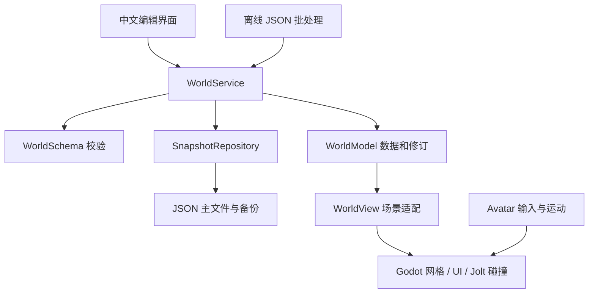

# 架构与命令契约

当前契约版本为 1。所有示例用于本机受控调用，尚不是可公开访问的网络 API。格式的执行依据为 [world_schema.gd](../godot/domain/world_schema.gd)、[world_service.gd](../godot/domain/world_service.gd) 和 [world_model.gd](../godot/domain/world_model.gd)。

## 1. 模块边界



- **Schema：** 世界和对象的纯数据结构、生成种子场景、完整性检查及 UUID。数据使用 JSON 可表达的值，不包含 Node、NodePath 或原生资源。
- **Model：** 持有世界快照。对候选副本完成验证后才替换状态，拒绝的编辑不改变当前数据。读写边界都复制容器，防止调用者通过引用绕过修改流程。
- **Service：** 命令版本、修订检查、单进程重复请求处理、归属校验、撤销、保存恢复、结果与脏状态。
- **Repository：** 快照封装、大小限制、SHA256、临时写入、回读校验、有效备份与文件替换。
- **WorldView：** 将持久化 ID 映射为可见网格和碰撞体；集中进行坐标转换。角色由独立的 CharacterBody3D 处理输入、重力、跳跃和碰撞。
- **main.gd：** 装配模块、相机及 UI 事件；命令成功后更新场景。当前更新会重建相关世界视图，适合小原型；尚未实现大型场景的增量更新。

Domain 使用 Godot 的基础数值和容器类型，独立于场景节点，但仍依赖 Godot 运行时，不是可以直接在 Python 或 C# 中运行的库。将来可以保留 JSON 语义并替换实现。

## 2. 世界格式

根对象字段固定为：

| 字段 | 内容 |
| --- | --- |
| `schema_version` | 当前为 1；未知版本被拒绝 |
| `revision` | 0–1,000,000,000 的整数；成功编辑递增 |
| `region` | `id`、`name`、`size`、`spawn`、`owner_id` |
| `terrain` | `columns`、`rows`、`spacing`、`heights` |
| `assets` | 当前恰好一个内置 box 资产描述 |
| `objects` | 最多 500 个单部件方块实例 |

坐标为 `[东, 北, 高]`，单位米；旋转为数据坐标系下的单位四元数 `[x,y,z,w]`。地形大小、采样间距和高程数量必须相符，数值必须有限。未知字段、重复物体 ID、未知资产、越界形状和不合法尺寸会被拒绝。500 是原型输入上限，不是已经测得的性能容量。详细语义见 [OpenSim 对应说明](opensim-data-mapping.md)。

种子世界在首次运行时生成。区域、内置资产和本机角色身份采用固定的测试 UUID；每个对象具有独立 UUID，首次保存后跨重启保留。固定身份仅用于本机归属验证，不是身份认证机制。

## 3. 命令和结果

完整入口是 `WorldService.dispatch(command)`。创建示例：

```json
{
  "api_version": 1,
  "request_id": "66666666-6666-4666-8666-666666666666",
  "operation": "CreateObject",
  "expected_revision": 0,
  "payload": {
    "object": {
      "id": "55555555-5555-4555-8555-555555555555",
      "name": "自动化方块",
      "asset_id": "22222222-2222-4222-8222-222222222222",
      "owner_id": "11111111-1111-4111-8111-111111111111",
      "position": [120, 120, 2],
      "rotation": [0, 0, 0, 1],
      "size": [2, 2, 4],
      "color": "#50A696"
    }
  }
}
```

成功结果的形状：

```json
{
  "api_version": 1,
  "ok": true,
  "operation": "CreateObject",
  "request_id": "66666666-6666-4666-8666-666666666666",
  "revision": 1,
  "payload": {"id": "55555555-5555-4555-8555-555555555555", "revision": 1},
  "warnings": [],
  "errors": []
}
```

| 操作 | payload | 效果 |
| --- | --- | --- |
| `GetRegionSnapshot` | `{}` | 返回独立的 `payload.world` 副本 |
| `CreateObject` | `{"object": 完整对象}` | 创建并验证资产、所有者和变换 |
| `UpdateObject` | `{"id": "UUID", "patch": {"name": "新名称"}}` | 只允许修改 name、position、rotation、size、color |
| `DeleteObject` | `{"id": "UUID"}` | 删除本机身份拥有的对象 |
| `Undo` | `{}` | 恢复最近一次成功编辑前的数据；最多 30 步 |
| `SaveRegion` | `{}` | 写入当前完整快照，成功后清除脏状态 |
| `LoadRegion` | `{}` | 校验并恢复存档，清空撤销历史；必要时回退到备份 |

复制、放到地面是客户端组织出的创建/更新命令；它们没有绕过统一入口。API 不支持执行任意 GDScript、加载调用方指定的原生资源或修改所有者。

失败结果保持同一结构，`ok=false`，`errors` 含 `code` 和 `message`。常见代码为 `INVALID_COMMAND`、`INVALID_PAYLOAD`、`REQUEST_REUSED`、`REVISION_CONFLICT`、`MUTATION_REJECTED`、`SAVE_FAILED`、`LOAD_FAILED`、`NOTHING_TO_UNDO`、`UNKNOWN_OPERATION`。数据校验的详细原因在 message 中，界面会展示。

### 修订和重试的准确范围

- `expected_revision` 必须等于当前修订，包括查询操作。进程内调用者可以读取 Model 的 revision；便捷方法 `request(operation, payload)` 自动填入当前修订和新请求 ID。
- 单个 Service 缓存最近 256 个请求结果。同一 ID、同一内容返回原结果，同一 ID 改内容返回 `REQUEST_REUSED`。
- 缓存不持久化；恢复存档会清空缓存，载入存档原有 revision，可能比当前内存修订更小。撤销则在当前 revision 上加一。
- 因此这不是跨重启的 exactly-once 机制，也不能直接用作多人同步版本协议。后续服务器需要增加会话/世界世代、认证、命令排序和持久化的去重规则。

## 4. 离线自动化适配器

[world_cli.gd](../godot/tools/world_cli.gd) 接受一个 JSON 数组，每项只有 `operation` 和 `payload`。由适配器调用 `request`，自动提供当次进程的请求 ID 与当前修订。示例见 [create-and-save.commands.json](../fixtures/create-and-save.commands.json)，完整启动命令见 [README](../README.md#5-自动化测试与-ai-调用入口)。

执行规则：

1. 必须显式传入世界文件、命令文件和报告文件；拒绝用报告路径覆盖这些输入及存档临时/备份路径。
2. 命令文件最多 1 MiB，数组为 1–100 项；先校验描述格式，再读取已有世界或生成种子世界。
3. 按顺序执行，首个失败立即停止，进程退出码为 1；全部成功退出 0。
4. **只有显式 `SaveRegion` 会持久化。批处理不是事务：如果前面的命令已经保存，后面的失败不会撤回已保存内容。**
5. 同一示例重复运行可能遇到对象 ID 已存在，需要查询已有状态或使用新的对象 ID。不要在图形程序同时打开同一世界时运行写入批处理。

这给未来 AI 工具调用提供了可以实际运行的最小接口。目前没有 HTTP 服务、在线模型推理、自然语言解析或远程调用鉴权。

## 5. 存储与恢复约定

磁盘文件是存储封装，字段为 `format="region-lab.snapshot"`、`version=1`、`sha256`、`world_json`。最后一个字段是包含完整世界的 JSON **文本字符串**。SHA256 针对该字符串的 UTF-8 文本计算；校验后再解析世界，不能先重新序列化浮点数再比较摘要。

每次写入先验证世界，再写 `.tmp`、flush、关闭及回读验证；如果当前主文件有效，再用 `.bak.tmp` 更新备份，最后替换主文件。读取主文件失败时尝试 `.bak`，恢复成功会返回 warning 并将世界标记为需重新保存。两份均无效时，不替换当前内存世界。

快照上限 8 MiB；不包含临时相机、当前角色位置、选择、撤销历史、模型会话、库存和脚本。摘要用于发现内容损坏，不是防恶意篡改的签名。对外部修改的文件指纹检查是单写入者的辅助保护，检查与替换之间没有跨进程锁；没有验证断电持久性。

## 6. 如何用 AI 辅助继续开发

每次给编程智能体一个具体能力及验收，例如“新增受限地形笔刷，保存重启后坡面及碰撞一致”。按以下顺序做：

1. 阅读当前数据对应表，明确改变哪个字段、坐标或生命周期；先定义合法和非法样例。
2. 修改 Schema/Model/Service 契约，再补引擎适配和界面，避免由 UI 直接写场景并另起一份数据。
3. 跑现有原生检查，并为新行为增加必要的真实碰撞、文件恢复或操作用例。
4. 有 UI 变化时运行 `-Visual`，检查实际截图；将日志、报告和观察到的问题写进验证记录。
5. 通过后再提交一个有边界的改动。自动化报告不能替代对界面、体验和功能覆盖范围的判断。

[AGENTS.md](../AGENTS.md) 已把这些规则写入原型目录。GameFactory 的参考版本和借鉴范围见 [选型记录](engine-decision.md)。
