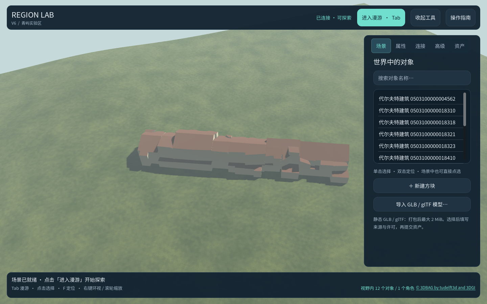

# 代尔夫特真实建筑片区样例

此样例把荷兰代尔夫特的一小片 **12 栋真实建筑**放进 Region Lab V6。建筑平面位置、尺寸和屋顶形状来自 [3DBAG 官方 3D API](https://docs.3dbag.nl/en/delivery/webservices/) 的 LoD 2.2 CityJSONFeature 数据，查询框为 RD 坐标 `85000,446700,85070,446770`（EPSG:7415）。[荷兰政府的市镇登记](https://standaarden.overheid.nl/resolve/tooi/id/gemeente/gm0503)确认建筑编号中的 `0503` 对应 Delft。

## 打开

在 Windows 文件管理器中双击 `prototype/打开代尔夫特真实建筑.cmd`。脚本首次运行会创建隔离的 `prototype/runtime/delft-julianalaan` 存档和网络实例，然后打开 V6 桌面客户端。后续运行复用同一实例和场景。若本仓库尚未安装 Godot 或编译 .NET 服务，先按[网络运行指南](network-quickstart.md)完成准备，也可向 `tools/Start-DelftPilot.ps1` 传入 `-Godot`、`-Store`、`-HostExecutable`。

无需网络服务时，可用 `Start.cmd -WorldFile "<仓库>\prototype\runtime\delft-julianalaan\world.json"` 打开离线编辑器；先运行上面的样例入口以生成存档。V6 客户端和离线编辑器读取相同的 12 栋建筑，但应分别使用自己的持久化实例，不要同时编辑一个文件或数据库。

## 数据与转换

- 原始 API 响应保存在 [`fixtures/geodata/delft-julianalaan-source.json`](../fixtures/geodata/delft-julianalaan-source.json)，源查询链接和 SHA-256 保存在生成的 [`manifest.json`](../fixtures/geodata/delft-julianalaan/manifest.json)。
- `python prototype/tools/Convert-3DBAG.py <CityJSONFeature响应.json> <输出目录>` 将单一响应中的 LoD 2.2 建筑按外表面三角化为独立 GLB，最多输出 16 个符合当前资产上限的建筑。脚本不执行联网操作。随后 `build_city_pilot.gd` 通过 `WorldService` 的 `ImportGlb`、`CreateObject`、`SaveRegion` 命令生成新存档。源响应中跨越区域、超过 32 米或含洞的建筑会列在 manifest 的 `skipped` 中，不会悄悄裁切。
- 处理其他荷兰片区时，可用 `--origin-east`、`--origin-north` 指定源 RD 原点，用 `--offset-east`、`--offset-north` 指定它在 256 米区域中的落点；manifest 同时记录因 `--limit` 未选择的建筑。现阶段只接收 3DBAG API 的 CityJSONFeature 响应和其中可独立装入的建筑，并非通用城市格式导入器。
- GLB 坐标按原始 RD 米制坐标作平移，保留相对位置。NAP 高程统一减去所选建筑最低点，使建筑落在本地模拟地面附近。墙、屋顶、底面被赋予演示颜色；这些颜色**不是**现场测得的外墙或实拍纹理。道路、植被、地形高程、建筑室内及门窗细节未取自测绘数据。该样例是地理形状与位置真实的建筑片区，不是照片级城市数字孪生。

3DBAG 数据按 [CC BY 4.0](https://creativecommons.org/licenses/by/4.0/) 提供。使用时保留指定署名 **© 3DBAG by tudelft3d and 3DGI**，链接到 [3DBAG 版权页](https://docs.3dbag.nl/en/copyright/)，并注明上述三角化、局部坐标平移和演示着色等更改。原始响应及派生 GLB 沿用该署名要求。

当前演示选取 12 栋建筑，占用 12/96 个导入资产槽。区域仍是 256×256 米的单区原型；更大街区、写实立面、摄影测量和城市 3D Tiles 流式加载仍需后续能力。
