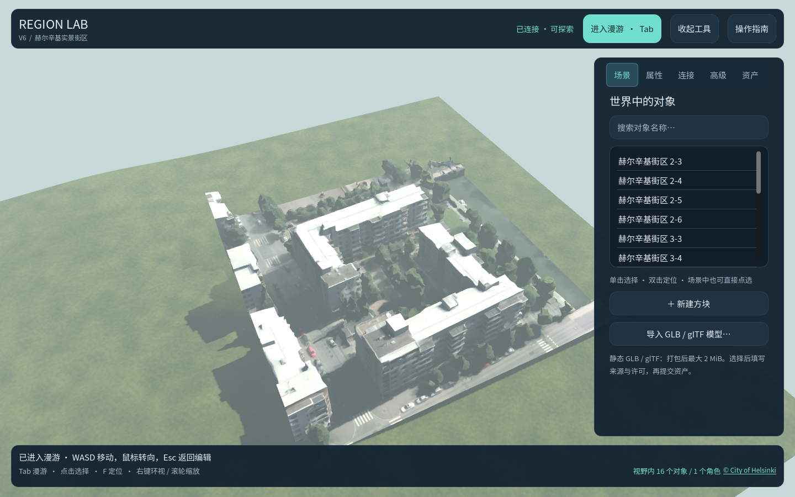

# 赫尔辛基实景街区样例

这是一个比代尔夫特建筑样例更大的真实地点演示：从赫尔辛基市 2017 年航拍生成的带纹理三维网格中，选取连续 **125×125 米**的街区，保留建筑、道路、树木和原始照片纹理。它由 16 个约 31.25 米的 GLB 组成，共约 3.3 万个三角面，在 Region Lab V6 的 256×256 米单区中展示。

## 打开

在 Windows 文件管理器中双击 `prototype/打开赫尔辛基实景街区.cmd`。它首次运行会生成隔离的 `prototype/runtime/helsinki-kamppi-v3` 存档和网络实例；之后复用同一实例。进入窗口后点击「知道了，收起指南」，再点击「进入漫游」或按 Tab；WASD 移动，Esc 返回编辑视角，鼠标滚轮可缩放俯瞰视角。

若服务程序或 Godot 未安装，先按[网络运行指南](network-quickstart.md)构建并安装。与代尔夫特实例同时运行时，此入口使用另一组端口 `20820–20822`。

## 来源与转换

- 来源为[赫尔辛基市官方 3D Mesh 开放数据](https://www.hel.fi/en/decision-making/information-on-helsinki/maps-and-geospatial-data/helsinki-3d)中的 [2017 OBJ 压缩包 `672494x2`](https://3d.hel.ninja/data/mesh/Helsinki3D-MESH_2017_OBJ_2km-250m_ZIP/Helsinki3D_2017_OBJ_672494x2.zip)，子目录 `672495a3` 的 LoD 19 网格。市政府说明，这份网格由航拍照片制作，按 [CC BY 4.0](https://creativecommons.org/licenses/by/4.0/) 开放。
- ZIP 的 `metadata.xml` 将坐标标为 `EPSG:3879+5773`，其中 [EPSG:5773 是 EGM96 高程](https://epsg.io/5773)；[市政府的总体说明](https://www.hel.fi/en/decision-making/information-on-helsinki/maps-and-geospatial-data/helsinki-3d)则称该模型使用 N2000。这里忠实记录源文件标签，未对两种高程基准作绝对转换。片区在来源模型局部坐标中的边界为东 `5312.5–5437.5` 米、北 `4093.75–4218.75` 米；模型原点是东 `25490000`、北 `6668000` 米。模型在 Region Lab 中平移至东 `64–189`、北 `32–157` 米，减去统一来源高程基准。相对位置与 1:1 米制尺寸保持不变。
- `tools/Convert-HelsinkiMesh.py` 将来源 OBJ 的三角形和 UV 转成 16 个内嵌 JPEG 的 GLB。照片纹理像素未重新绘制。每块 GLB 的 SHA-256、原始 OBJ/JPEG 文件名与 SHA-256 都记录在 [`manifest.json`](../fixtures/geodata/helsinki-kamppi-textured/manifest.json)。仓库保存转换后的约 1.4 MB 样例资源，不保存完整源 ZIP。
- 复现时，从官方 ZIP 解压 `672495a3/*_L19_*` 的 OBJ 与 JPEG 到一个目录，然后运行 `python prototype/tools/Convert-HelsinkiMesh.py <解压目录> <全新输出目录>`。`build_city_pilot.gd` 通过 `WorldService` 命令导入资源、摆放网格、设置区域名称和安全出生点，再保存存档。

**署名：© City of Helsinki, Helsinki 3D Mesh 2017，CC BY 4.0。** 本项目所做的改动包括截取 16 个网格、坐标平移与轴转换、OBJ/JPEG 封装为 GLB，以及设置独立演示区域。客户端底部会显示来源入口。

这是 2017 年航拍网格的一个静态片段，不代表当前建筑现状。片区以外仍为原型自带的程序地形；模型边缘可能出现航拍重建缝隙，建筑室内没有单独建模。现有系统最多容纳 16 个导入资产，每个资产最长边 32 米、文件上限 2 MiB，因此这个样例已用完单区导入槽，尚不能连续加载整座城市或通用 3D Tiles。
