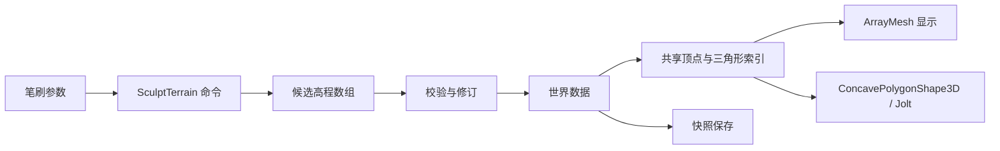

# OpenSim 数据模型对应说明

适用版本：Region Lab 0.4.2。参考源码：OpenSimulator 提交 `1f4a6dd1d3ff653ecc2748a7764106c30ac4ef9d`。

本文件定义当前原型与 OpenSim 概念的对应关系，标明已实现的数据范围及后续扩展边界。现阶段尚未提供旧数据库、OAR 或 Viewer 协议迁移能力。

## 1. 模块对应

| OpenSim 概念与源码 | Region Lab 实现 | 当前范围 |
| --- | --- | --- |
| [RegionInfo](../../OpenSim/Framework/RegionInfo.cs) | `region` | UUID、名称、尺寸、起点、归属；`RenameRegion`、`SetRegionSpawn` 和 `SetRegionSize` 可由区域所有者修改名称、出生点和 256／512 米边长；仍为单区域 |
| [TerrainData](../../OpenSim/Framework/TerrainData.cs) | `terrain` | 高程数组、采样间距、行列数、保存恢复 |
| [TerrainModule](../../OpenSim/Region/CoreModules/World/Terrain/TerrainModule.cs) | TerrainBrush、SculptTerrain | 四种笔刷、区域归属检查、图形与碰撞更新；未复现原协议参数及全部笔刷算法 |
| [RegionSettings](../../OpenSim/Framework/RegionSettings.cs) | environment、EnvironmentView | 水位、太阳时刻、雾和地表显示；程序材质近似高度/坡度分层，未实现原纹理 UUID 或 EEP |
| [Scene](../../OpenSim/Region/Framework/Scenes/Scene.cs) | WorldModel、WorldService、main.gd | 世界状态、编辑命令及运行装配 |
| [SceneObjectGroup](../../OpenSim/Region/Framework/Scenes/SceneObjectGroup.cs)、[SceneObjectPart](../../OpenSim/Region/Framework/Scenes/SceneObjectPart.cs) | `groups[]` + `objects[]` | 根与子部件、局部变换、组操作；仅为 linkset 子集，未实现附件或完整 prim 参数 |
| [ScenePresence](../../OpenSim/Region/Framework/Scenes/ScenePresence.cs) | Avatar、CharacterBody3D | 本地角色、相机、步行／快跑／飞行输入及碰撞；飞行与速度不写入世界存档，未实现账户会话与外观库存 |
| [AssetBase](../../OpenSim/Framework/AssetBase.cs) | `assets[]` | 六项内置目录及内嵌静态 GLB，通过 asset_id 复用；不兼容 OpenSim mesh asset 编码 |
| [InventoryItemBase](../../OpenSim/Framework/InventoryItemBase.cs)、[TaskInventoryItem](../../OpenSim/Framework/TaskInventoryItem.cs) | 后续库存实体 | 当前不包含库存记录、父对象关系和权限位 |
| [PhysicsScene](../../OpenSim/Region/PhysicsModules/SharedBase/PhysicsScene.cs) | WorldView、Avatar、Jolt | 静态对象、门状态碰撞、三角网格地形和角色；未实现车辆、约束和动态物体编辑 |
| [ISimulationDataStore](../../OpenSim/Region/Framework/Interfaces/ISimulationDataStore.cs) | RepositoryContract / JSON / SQLite | 现代区域事务和备份；不复用或兼容原版数据库表 |
| [SceneObjectPartInventory](../../OpenSim/Region/Framework/Scenes/SceneObjectPartInventory.cs)、[ScriptEngine](../../OpenSim/Region/ScriptEngine/) | 内置 door/lamp 状态 | E 键及右键菜单只触发已有 `SetObjectState` 权限命令；开关状态可存档，不包含脚本条目、LSL/OSSL 或任意事件处理程序 |

## 2. 实体和标识

| 字段 | 定义 |
| --- | --- |
| `region.id` | 区域 UUID；当前使用固定演示标识，尚无 Grid 注册 |
| `region.owner_id` | 区域归属；地形与环境命令校验该字段 |
| `objects[].id` | 物体实例 UUID，保存、恢复和历史操作保持一致 |
| `objects[].asset_id` | 资产定义标识；支持六项内置目录和经校验的网格内容 ID |
| `objects[].owner_id` | 物体归属；修改、删除与行为命令校验该字段 |
| `objects[].position` | 未组合时为区域坐标，组合成员为组内局部坐标；`[东, 北, 高]`，米 |
| `objects[].group_id` | 所属组 UUID，独立对象为空字符串 |
| `objects[].rotation` | 数据坐标系下的单位四元数 `[x,y,z,w]` |
| `objects[].size` | 局部或世界各轴尺寸；投影后每轴 0.2–32 米 |
| `objects[].color` | 整体颜色 `#RRGGBB`，未实现分面材质 |
| `objects[].material` | 内置表面类型；不等价于 OpenSim 分面纹理条目 |
| `objects[].state` | door/lamp 的 active 状态，其它对象为空字典 |
| `objects[].name` | 1–80 字符的非空名称 |

Godot 节点只保存运行时映射。NodePath、节点实例编号及引擎指针不作为持久化标识。资产 ID 表示资源定义，库存条目还需独立身份、父级和权限，二者不可合并。

## 3. 坐标与旋转

区域数据采用 X 向东、Y 向北、Z 向上，单位米。Grid 全局位置尚未建模。WorldView 集中承担坐标转换：

```text
区域 [x, y, z]  → Godot (x, z, -y)
Godot (x, y, z) → 区域 [x, -z, y]
256 米区域东北角 [256, 256, 0] → Godot (256, 0, -256)
512 米区域东北角 [512, 512, 0] → Godot (512, 0, -512)
```

3DBAG 片区试点在导入前把 EPSG:7415 的米制 `(RD 东, RD 北, NAP 高)` 转为本地区域坐标。它减去固定 RD 原点，加上区域内偏移，并从高度减去一个固定 NAP 基准；各建筑之间的相对位置和尺寸保持不变。原始坐标系、原点、基准和建筑 ID 记录在[试点说明](delft-real-city-pilot.md)及其 manifest，Region Lab 存档本身仍只存局部 `[东, 北, 高]`，不表示完整的全球地理坐标系。

[赫尔辛基实景街区](helsinki-textured-city-pilot.md)采用相同的局部坐标原则，但来源是 EPSG:3879+5773 的 OBJ/JPEG 航拍网格。转换保留 125×125 米连续片区中的几何、相对位置和实拍纹理，把每个 31.25 米样块封装为可验证的 GLB。区域名称和出生点通过 `WorldService` 的 `RenameRegion`、`SetRegionSpawn` 命令设置；它们不改变区域 UUID、尺寸或全球地理坐标语义。

旋转采用基变换 `B_engine = C × B_region × inverse(C)`。UI 当前只编辑绕区域 Z 轴的水平角；未修改旋转时保留原四元数。

物体的水平边界检查采用旋转后的完整包围范围。地形变化不自动修改物体变换；“放到地面”按物体中心查询地面并按半高放置，适用于当前直立对象，不是完整地基拟合。

## 4. 地形模型

种子地形采用 65×65 个高程样本、4 米间距和 64×64 个网格单元，覆盖 256×256 米。`SetRegionSize` 扩至 512 米时生成 129×129 样本，保留原采样并把边缘高度延伸到新区域；它不获取真实地形数据。数组索引为 `north_index * columns + east_index`，包含最东和最北边界。采样分辨率与原版默认数据不同，未来导入需要显式重采样。

地形数据经过以下路径处理：



每次笔刷操作保存为一个历史步骤。平滑操作读取修改前的邻域数据，避免遍历顺序影响结果。显示网格、地面高度查询和碰撞体采用同一三角形划分，具体公式与参数见 [接口文档](architecture-and-api.md)。

V1 使用 HeightMapShape3D；V2 调整为共享三角形的静态碰撞体。该变化位于引擎适配层，存档仍保存高度场，V2 世界格式保持为 1。V3 因环境、材质及行为字段升级到格式 2，地形数组本身不变。

## 5. 创建、编辑与恢复

1. UI 或离线工具提交命令，Service 检查请求版本、重复请求和当前修订。
2. Model 检查归属及候选世界；验证通过后一次替换数据。
3. WorldView 更新物体或地形。地形更新保留物体节点及其变换。
4. Repository 保存区域、地形、环境、资产描述、物体材质和行为状态，不序列化运行时节点。
5. 恢复时验证封装、校验和及世界结构，再替换数据并重建场景；失败时保留内存世界。
6. 恢复后角色返回区域起点；若起点地形已抬升，角色被放置在地面上方。

OpenSim 的 `StoreObject` 不保存库存，库存通过 `StorePrimInventory` 单独持久化。当前快照只覆盖已定义实体；后续库存、脚本状态和完整权限需分别定义持久化与恢复规则。


## 6. 环境与行为的对应边界

RegionSettings 的 WaterHeight 为区域水面高度提供了明确参考；V3 使用米制 water_height，渲染为区域水平面。太阳时刻属于可视环境配置，未复刻原版 SunPosition、UseEstateSun 和 Viewer 环境协议的全部语义。TerrainTexture1–4 的外部纹理 UUID 尚未导入，现阶段以程序化草地、岸边与陡坡表面表达地表差异。

OpenSim 的门灯通常依赖物体属性及脚本事件。V3 将其缩小为两个可验证的内置行为：开门改变显示几何与通行碰撞，开灯改变原生局部灯光；状态随区域保存。没有复制脚本库存、事件队列、权限位或完整脚本生命周期。

V3.1 的示例展馆采用 15 个部件构成的组，地板为根，组记录保存世界变换，成员记录局部变换。门仍是一个有独立状态的成员，其内部引擎节点不再细分为可编辑部件。模型公式、根的约束及 API 世界坐标语义见 [组合与资产规范](groups-and-assets.md)。

## 7. 组合及资产与原版的差异

| 概念 | 当前对应 | 差异与后续验证 |
| --- | --- | --- |
| SceneObjectGroup 的根/部件集合 | groups.root_id、objects.group_id | 建组与解除保留部件 ID；组拥有独立 UUID，不假定与原版组 ID 规则完全一致 |
| RootPart / OffsetPosition | 组世界坐标与成员局部坐标 | 已完成固定原版两部件静态案例的世界变换对照；见下方运行证据 |
| 子部件旋转与尺寸 | 局部四元数、局部尺寸、组统一倍率 | 禁止嵌套组与剪切；不复刻 OpenSim 全部缩放限制 |
| AssetBase 的资源内容 | GLB 字节、完整 SHA256、许可与作者 | 使用 glTF 静态子集，不读取原版 mesh、纹理编码或库存 |
| 可交互建筑 | GLB 建筑实例与独立 door 成员可组合 | GLB 内部节点不可自动转为脚本对象，也不自动识别门 |

格式 3 迁移不会根据名称自动将旧物体合组。资产引用与库存条目仍分离：同一资产可以被多个对象实例引用，未来库存还需要独立身份、权限和转移规则。现代 SQLite 已按独立合同实现；OAR、原版数据库迁移与完整 Viewer 协议仍是单独兼容任务。

## 8. V4 首批运行证据

2026-09-16 已独立构建并实际运行固定 OpenSim 0.9.3.0，使用同一两部件案例核对平移、Z 轴旋转、子部件编辑、统一缩放、复制、解除与正常重启。130 项世界变换比较通过，容差为每分量 0.0002；该数字不表达两个物理引擎的确定性或普遍误差上限。

原版组 UUID 等于根部件 UUID；本原型组 UUID 独立。原版根 RotationOffset 保存组世界旋转，原型根局部旋转为单位四元数。原版统一缩放直接改写子偏移和尺寸，原型保留局部记录与组倍率。应先解析各自记录，再合成和比较世界变换，不能按字段名称直接复制。

初次步骤及原始 JSON 见 [两部件运行对照](../../docs/comparisons/v4-reference-linkset.md)。本轮补充 Viewer 根/子部件显示、跨归属拒绝和受控 Bot/FP 实验，见 [V4 综合验收](../../docs/comparisons/v4-completion.md)。任意脚本、完整库存和原版 mesh asset 编码仍未复刻。

## 9. V4 仓储与融合边界

现代数据库保存独立区域、组、成员、资产元数据和内容引用。组 ID 仍独立，记录保留原世界格式 3；外置 GLB 是存储封装变化，不改变实例或资产语义。世界 revision、存储 commit_revision、存储 epoch 与 FP 运行 world_epoch 分别管理。JSON 世界转 SQLite 时先复用生产校验，迁移只写新目标；恢复包产生新存储世代。

原版 FP 使用原始 SceneObjectGroup/Part/ScenePresence 身份，坐标为 X 东、Y 北、Z 高；转换到现代实例需明确原/目标 ID 映射，不能假定一个 UUID 同时表示组和根。快照及 upsert/delete 是帧观察结果，不代表所有原版物理/脚本活动的全局事务。原版与现代世界各自保持一个状态权威。详见 [FP 合同](../../docs/contracts/fp-v02.md) 与 [存储合同](../../docs/contracts/storage-v4.md)。

## V5 网络语义补充

现代区域采用新的 FP 0.3 投影和命令协议，并不实现 Linden UDP/CAPS 或 Firestorm 登录。会话 principal 与领域 actor 分离，两个演示编辑主体显式共享 OWNER 授权；这不是完整 OpenSim 用户、组权限或库存映射。Avatar 输入由 Godot/Jolt 服务端步进，角色为连接生命周期对象，重启回出生点；尚未映射原版 AgentPosition 持久化。

## 后续资产容量与存储语义

格式 3 世界的 `assets[]` 仍记录稳定的内容 ID、完整 SHA-256、边界、许可和来源；物体继续通过 `asset_id` 引用它。JSON 快照封装升级为版本 2：世界文件中只存网格元数据，GLB 按哈希放在同名 `.assets/` 目录内。复制或备份 JSON 世界时必须连同该目录一起复制。版本 1 内嵌快照仍可读取；下一次保存会写出版本 2。缺失、超长或哈希不符的内容会使整个快照加载失败，不会悄悄丢掉物体；有效 `.bak` 可以恢复前一个状态。

SQLite 的 `assets` 行继续保存引用，二进制位于存储根目录的 `objects/`。存储进程读写和备份以引用传递，避免把全部模型反复塞入世界 JSON；备份包仍包含所有被世界或库存引用的内容。当前网格目录上限由 64 提至 96，Web/桌面客户端仍按可见范围请求模型。但权威服务当前仍会把区域内注册的 GLB 全部装入内存，尚无服务器侧分块、内存预算或几何 LOD，因此不能据此推断整座城市的承载能力。

对象、组和地形仍复用 V3/V4 的同一世界格式及坐标变换。V5 将圆柱/球和地形碰撞体改为从 CPU 几何构建，避免 WebGL 显卡回读；回归同时比较旧渲染解码几何，对比样例的凸包顶点误差小于 0.5 毫米，地形面顶点误差小于 10 微米。该误差来自旧网格编码/解码量化，不修改保存的世界坐标。实际通行和门灯碰撞继续经过原生物理测试。

原版 FP 0.2 网关和现代 FP 0.3 服务分别运行，每个世界只有一个权威。当前没有自动双向镜像原版场景；统一平台联调由后续版本完成。
