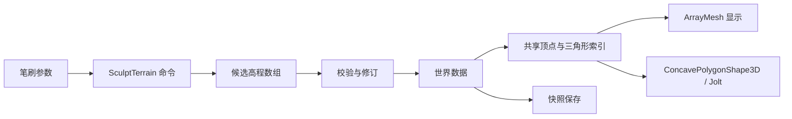

# OpenSim 数据模型对应说明

适用版本：Region Lab 0.2.0。参考源码：OpenSimulator 提交 `1f4a6dd1d3ff653ecc2748a7764106c30ac4ef9d`。

本文件定义当前原型与 OpenSim 概念的对应关系，标明已实现的数据范围及后续扩展边界。现阶段尚未提供旧数据库、OAR 或 Viewer 协议迁移能力。

## 1. 模块对应

| OpenSim 概念与源码 | Region Lab 实现 | 当前范围 |
| --- | --- | --- |
| [RegionInfo](../../OpenSim/Framework/RegionInfo.cs) | `region` | UUID、名称、尺寸、起点、归属；固定单区域 256×256 米 |
| [TerrainData](../../OpenSim/Framework/TerrainData.cs) | `terrain` | 高程数组、采样间距、行列数、保存恢复 |
| [TerrainModule](../../OpenSim/Region/CoreModules/World/Terrain/TerrainModule.cs) | TerrainBrush、SculptTerrain | 四种笔刷、区域归属检查、图形与碰撞更新；未复现原协议参数及全部笔刷算法 |
| [RegionSettings](../../OpenSim/Framework/RegionSettings.cs) | 固定环境及程序地形材质 | 灯光与基础材质；未实现原环境与地表纹理分层 |
| [Scene](../../OpenSim/Region/Framework/Scenes/Scene.cs) | WorldModel、WorldService、main.gd | 世界状态、编辑命令及运行装配 |
| [SceneObjectGroup](../../OpenSim/Region/Framework/Scenes/SceneObjectGroup.cs)、[SceneObjectPart](../../OpenSim/Region/Framework/Scenes/SceneObjectPart.cs) | `objects[]` | 单部件方块、区域内变换、颜色与归属；未实现 linkset、附件和复杂 prim |
| [ScenePresence](../../OpenSim/Region/Framework/Scenes/ScenePresence.cs) | Avatar、CharacterBody3D | 本地角色、相机、输入及碰撞；未实现账户会话与外观库存 |
| [AssetBase](../../OpenSim/Framework/AssetBase.cs) | `assets[]` | 一个内置方块资产，通过 asset_id 引用 |
| [InventoryItemBase](../../OpenSim/Framework/InventoryItemBase.cs)、[TaskInventoryItem](../../OpenSim/Framework/TaskInventoryItem.cs) | 后续库存实体 | 当前不包含库存记录、父对象关系和权限位 |
| [PhysicsScene](../../OpenSim/Region/PhysicsModules/SharedBase/PhysicsScene.cs) | WorldView、Avatar、Jolt | 静态方块、三角网格地形和角色；未实现车辆、约束和动态物体编辑 |
| [ISimulationDataStore](../../OpenSim/Region/Framework/Interfaces/ISimulationDataStore.cs) | SnapshotRepository | 完整区域快照及备份；未实现原数据库适配 |
| [SceneObjectPartInventory](../../OpenSim/Region/Framework/Scenes/SceneObjectPartInventory.cs)、[ScriptEngine](../../OpenSim/Region/ScriptEngine/) | 后续行为与脚本实体 | 当前不包含 LSL/OSSL 运行时和脚本状态 |

## 2. 实体和标识

| 字段 | 定义 |
| --- | --- |
| `region.id` | 区域 UUID；当前使用固定演示标识，尚无 Grid 注册 |
| `region.owner_id` | 区域归属；地形命令校验该字段 |
| `objects[].id` | 物体实例 UUID，保存、恢复和历史操作保持一致 |
| `objects[].asset_id` | 资产定义标识；当前仅支持固定 unit-box |
| `objects[].owner_id` | 物体归属；修改与删除命令校验该字段 |
| `objects[].position` | 区域内位置 `[东, 北, 高]`，米 |
| `objects[].rotation` | 数据坐标系下的单位四元数 `[x,y,z,w]` |
| `objects[].size` | 各轴尺寸，米；每轴 0.2–32 |
| `objects[].color` | 整体颜色 `#RRGGBB`，未实现分面材质 |
| `objects[].name` | 1–80 字符的非空名称 |

Godot 节点只保存运行时映射。NodePath、节点实例编号及引擎指针不作为持久化标识。资产 ID 表示资源定义，库存条目还需独立身份、父级和权限，二者不可合并。

## 3. 坐标与旋转

区域数据采用 X 向东、Y 向北、Z 向上，单位米。Grid 全局位置尚未建模。WorldView 集中承担坐标转换：

```text
区域 [x, y, z]  → Godot (x, z, -y)
Godot (x, y, z) → 区域 [x, -z, y]
区域东北角 [256, 256, 0] → Godot (256, 0, -256)
```

旋转采用基变换 `B_engine = C × B_region × inverse(C)`。UI 当前只编辑绕区域 Z 轴的水平角；未修改旋转时保留原四元数。

物体的水平边界检查采用旋转后的完整包围范围。地形变化不自动修改物体变换；“放到地面”按物体中心查询地面并按半高放置，适用于当前直立方块，不是完整地基拟合。

## 4. 地形模型

种子地形采用 65×65 个高程样本、4 米间距和 64×64 个网格单元，覆盖 256×256 米。数组索引为 `north_index * columns + east_index`，包含最东和最北边界。采样分辨率与原版默认数据不同，未来导入需要显式重采样。

V2 地形数据经过以下路径处理：



每次笔刷操作保存为一个历史步骤。平滑操作读取修改前的邻域数据，避免遍历顺序影响结果。显示网格、地面高度查询和碰撞体采用同一三角形划分，具体公式与参数见 [接口文档](architecture-and-api.md)。

V1 使用 HeightMapShape3D；V2 调整为共享三角形的静态碰撞体。该变化位于引擎适配层，存档仍保存高度场，世界格式版本保持为 1。

## 5. 创建、编辑与恢复

1. UI 或离线工具提交命令，Service 检查请求版本、重复请求和当前修订。
2. Model 检查归属及候选世界；验证通过后一次替换数据。
3. WorldView 更新物体或地形。地形更新保留物体节点及其变换。
4. Repository 保存区域、地形、资产描述和物体，不序列化运行时节点。
5. 恢复时验证封装、校验和及世界结构，再替换数据并重建场景；失败时保留内存世界。
6. 恢复后角色返回区域起点；若起点地形已抬升，角色被放置在地面上方。

OpenSim 的 `StoreObject` 不保存库存，库存通过 `StorePrimInventory` 单独持久化。当前快照只覆盖已定义实体；后续库存、脚本状态和完整权限需分别定义持久化与恢复规则。
