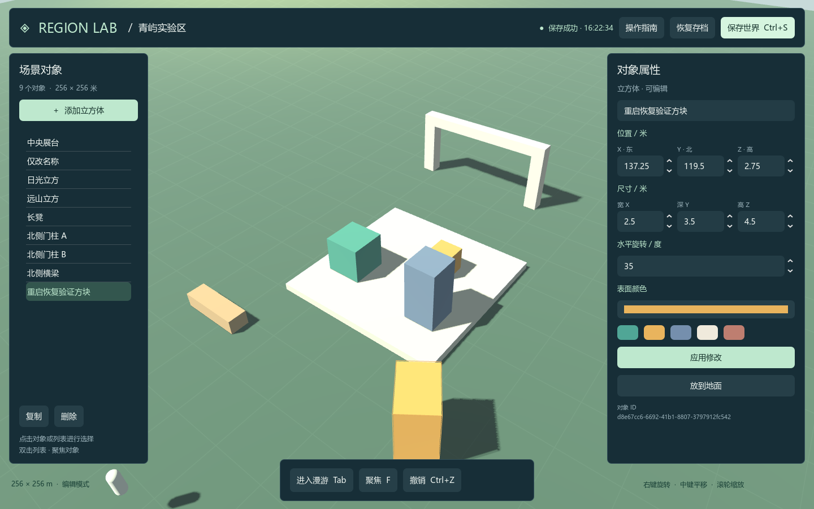

# 原型验证记录

日期：2026-09-14。结论适用于本分支的本机单区域原型；不等于原版 OpenSim 已编译成功或全平台兼容性验收。

## 1. 实测环境

| 项目 | 本次记录 |
| --- | --- |
| 操作系统 | Windows 11 家庭版中文版 x64，版本 10.0.26200 |
| 启动及测试脚本 | Windows 自带 `powershell.exe`，PowerShell 5.1 |
| 引擎 | `4.5.1.stable.official.f62fdbde1`，官方标准版 |
| 图形 | NVIDIA GeForce RTX 5060 Laptop GPU；OpenGL 3.3；驱动输出 NVIDIA 592.01 |
| 物理 | 项目配置为 Jolt Physics，测试实际调用原生碰撞和角色运动 |
| 依赖来源 | 官方 Windows x64 ZIP，归档和可执行文件均校验 SHA512；见 [锁文件](../engine.lock.json) |

界面截图来自 Godot 的实际渲染输出，没有用网页、设计图或其它图像代替。UI 测试通过引擎 Viewport 注入控件点击和按键事件，并校验世界状态、场景节点及碰撞体；它不是 Windows 桌面鼠标自动化。

## 2. 已执行检查

在 `prototype` 目录执行：

```powershell
powershell.exe -NoProfile -ExecutionPolicy Bypass -File .\tools\Test-RegionLab.ps1 -Visual
```

| 检查 | 结果 | 验证重点 |
| --- | --- | --- |
| 原生数据、存储、物理 | **46 / 46 通过** | 数据边界、UUID、修订、归属、编辑、撤销、损坏恢复、失败写入、真实 Jolt 地形和碰撞 |
| 实际界面与渲染 | **18 / 18 通过** | 面板布局、创建、属性应用、保存/恢复确认、删除/撤销、进入漫游及退出、两张真实截图 |
| 两个独立引擎进程 | **写入及读取均通过** | 第一个进程创建和保存后退出，第二个进程加载并检查同一 ID、名字、位置、尺寸、颜色 |
| 离线 JSON 命令入口 | **通过** | 创建、保存、查询三个命令；报告成功且世界对象数由 8 变为 9 |

可查看提交内的 [汇总报告](evidence/summary.json)、[46 项完整报告](evidence/native-report.json) 和 [18 项完整报告](evidence/visual-report.json)。测试目录的完整日志保留在本机 `test-results/run-.../`，不将用户路径、临时存档或引擎二进制提交到仓库。

### 不只检查正常保存

原生用例还验证了：

- 第二次保存留下前一份有效备份；主文件损坏后恢复备份并返回提示。
- 校验和发现内容被更改；两份存档都无效时保留当前内存世界。
- 发布文件失败时不标记为已保存；外部已修改主文件时拒绝直接覆盖。
- 浮点属性恢复误差不超过 `1e-6`；UUID、字段和结构保持一致。
- UI 只改名称时，未修改的高精度位置数值不被显示精度截断。
- 胶囊角色在原生高度场落地、跳起再落地、按输入移动，被静态方块阻挡。
- 北向高程、碰撞射线和数据到引擎的坐标映射一致。

18 项 UI 检查中包含两项截图生成检查；不能把检查数量直接当成完整功能覆盖率。UI 属性通过实际控件值设置和按钮事件应用，未模拟人工逐字键入全部字段。

## 3. 独立目录复现

复现使用 Git 暂存树导出的 `prototype/` 文件，在同一 Windows 机器的一个**路径含空格的新目录**运行。副本不带 `.tools/`、`.godot/` 缓存和已有存档。这检验仓库内容能独立启动，不是全新操作系统或另一台电脑的验证。

复现顺序：

```powershell
.\Install.cmd
.\Start.cmd -WorldFile "$PWD\runtime\launch-check.json" -Screenshot "$PWD\test-results\launch.png"
powershell.exe -NoProfile -ExecutionPolicy Bypass -File .\tools\Test-RegionLab.ps1 -Visual
```

结果全部通过：安装校验成功，首次启动渲染 8 个物体，随后 46 项原生和 18 项界面检查、两个独立进程恢复及离线命令验证全部通过。对应结果及实际测试代码的 SHA256 见 [独立目录汇总](evidence/clean-reproduction.json)。离线 `-ArchivePath` 安装方式也已在本机执行。

首次尝试已完整下载官方包，但暴露了 PowerShell 7 经 CMD 调用系统 PowerShell 时的模块搜索路径问题。修复两个 CMD 入口后，使用同一完整下载包重新校验并安装成功；修复后运行代码与本分支文件逐字节核对一致。直接启动在编辑器导入和全套测试之前进行，未依赖已有项目缓存。

## 4. 实际画面

初始演示世界：


通过属性面板创建、编辑并保存后的世界：



已人工检查两张引擎截图：中文内容可读，左右面板及底部操作栏位于窗口内，场景显示真实物体、选择描边与阴影。截图用于界面审阅，不能单独证明碰撞或恢复正确，因此同时提供上述原生测试。

## 5. 未完成和未验证的部分

| 项目 | 当前边界及下一步 |
| --- | --- |
| 原版行为对照 | 原 OpenSim 源码尚未完成首次构建/启动；需建立原版实例，逐项对照当前概念映射 |
| 地形编辑与导入 | 已保存程序生成高程并生成碰撞，尚无地形画刷、OAR、无人机、CAD/BIM 或网格资产导入 |
| 数据库 | JSON 单写入者快照；PostgreSQL、迁移、事务、跨进程锁与断电恢复仍需独立实施和测试 |
| 多人及权限 | 无远程服务器、同步、登录、完整权限位、组、库存和脚本；固定本机 owner 仅验证基本归属 |
| 引擎物理范围 | 角色、地形、静态方块；没有动态刚体编辑、车辆或约束兼容验收 |
| AI | 有确定性命令适配器，没有接入模型、自然语言动作或完整 GameFactory 生成流程 |
| 平台和发布 | 当前为 Windows 项目运行；未测试 Linux/macOS/Web、独立导出包、安装器或升级迁移 |
| 性能和规模 | 演示为 8–9 个物体；未跑 500 物体容量、多人延迟或城市级规模测试 |

下一步建议先做原版运行基线和一个可保存的地形笔刷，补充同一地形在显示、物理和恢复后的验收；再设计数据库服务、区域权威状态及双客户端同步。保留当前单区域回归作为后续每次改动的检查关口。
