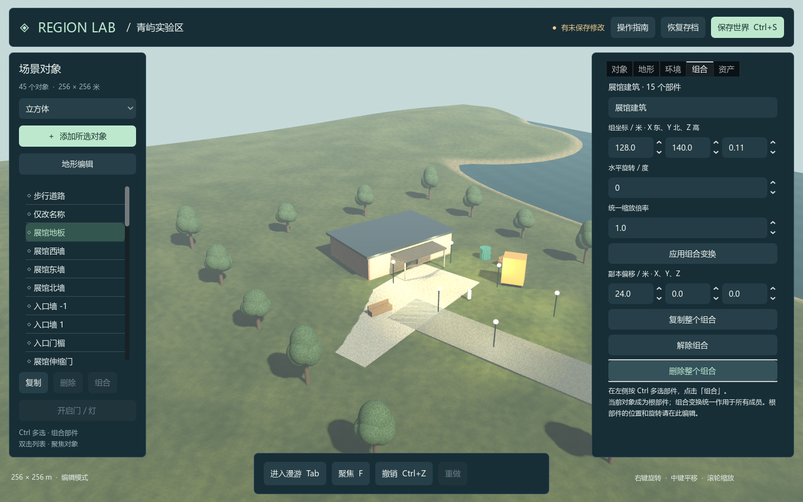
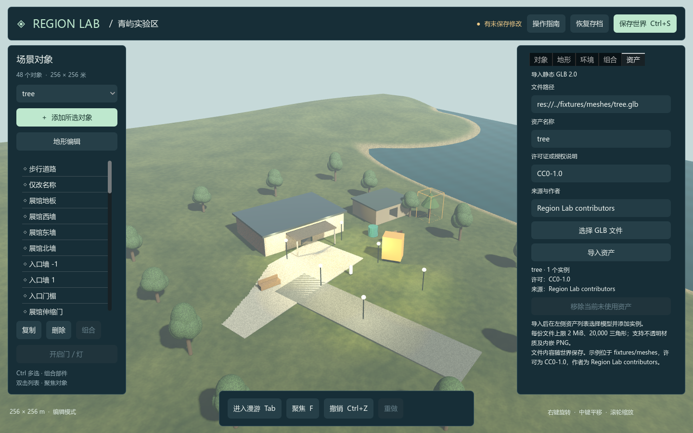

# V5 验证记录

版本：0.5.1，验证日期：2026-09-16。V5.0 已完成，V5.1 功能检查通过；Firefox 冷启动超过规划的 10 秒门槛，**V5 整体验收仍未通过**。

| 检查组 | 结果 |
| --- | --- |
| 原生数据、存储与真实物理 | 191 / 191 |
| 离线界面与渲染 | 66 / 66，另检查实际截图 |
| 网络数据合同 | 16 / 16 |
| SQLite 独立进程 | 53 / 53 |
| 权威区域与两个真实桌面客户端 | 64 / 64 |
| Chromium / Firefox | 75 项通过，1 项冷启动性能断言失败 |
| 离线包与正式启动入口 | 11 / 11；428 个文件摘要校验通过 |

原生回归包含两类跨进程恢复及三组离线批处理。浏览器报告保留失败结果；其中 `suite completion` 是性能断言失败的汇总，不计为另一个独立缺陷。浏览器后台测试采用原生窗口最小化与确定性帧暂停，未声明覆盖实际标签页节流、系统睡眠或移动端后台。

完整环境、逐项验收、正式入口部署、测量方法和保留限制见 [V5 验收记录](../../docs/comparisons/v5-completion.md)，原始 JSON、构建摘要和截图见 [证据目录](../../docs/comparisons/evidence/v5-20260916/README.md)。测试全部使用独立实例，未覆盖用户存档。复现入口为 [Test-V5.ps1](../tools/Test-V5.ps1)，浏览器依赖配置见 [Web 验证说明](../../integration/web/README.md)。GitHub 自托管工作流已提供，但尚未在远程执行。

---

# V4.2 历史验证记录

版本：0.4.2。验证日期：2026-09-16。最终桌面原生 **188/188**、界面 **66/66**、两类跨进程恢复和三组批处理通过；7 张实际渲染图另行检查。

V4 新增原版 FP、SQLite、Web 和真实建筑的独立测试，不能用桌面检查代替。完整统计、失败修复、运行条件与证据见 [V4 综合验收报告](../../docs/comparisons/v4-completion.md) 和 [21 项任务记录](../../docs/plans/v4-progress.md)。

本次公开数据库启动另有 6 项检查：实际恢复 44 对象、1 组、建筑网格、修订 3，界面显示已保存。测试使用隔离数据库，未覆盖用户存档。

以下保留 V3.1 的原始性能和历史环境记录，其中“未完成”指当时版本；当前能力以以上 V5 报告为准。

---

# V3.1 历史验证记录

版本：0.3.1。验证日期：2026-09-15。

## 1. 环境

| 项目 | 实测配置 |
| --- | --- |
| 系统 | Windows 11 x64，10.0.26200 |
| 处理器 | Intel Core Ultra 7 255HX |
| 显卡与驱动 | NVIDIA GeForce RTX 5060 Laptop GPU，NVIDIA 592.01 |
| 引擎 | Godot 4.5.1 标准版，4.5.1.stable.official.f62fdbde1 |
| 图形与物理 | Compatibility / OpenGL 3.3，Jolt |
| 安装与脚本 | 官方固定归档 SHA512 校验，Windows PowerShell 5.1 |

## 2. 执行方法与结果

在 prototype 目录运行：

```powershell
powershell.exe -NoProfile -ExecutionPolicy Bypass -File .\tools\Test-RegionLab.ps1 -Visual
powershell.exe -NoProfile -ExecutionPolicy Bypass -File .\tools\Measure-RegionLab.ps1
```

| 检查组 | 结果 | 覆盖内容 |
| --- | --- | --- |
| 原生数据、存储与物理 | 188 / 188 | 原有功能、组合、GLB 子集与异常输入、旧格式迁移、原生碰撞 |
| 界面与渲染 | 66 / 66 | 原有编辑、Ctrl 多选、组合操作、导入、长名称布局、实例创建与恢复 |
| 独立进程恢复 | 通过 | 原有地形、环境、门状态与物体恢复 |
| 内嵌资产独立进程恢复 | 通过 | 导入后删除临时源 GLB，保存并退出；只搬移世界文件，另进程恢复组与网格 |
| 离线批处理 | 3 组通过 | 物体创建、地形操作、环境与门状态；共用命令服务 |
| 性能工作负载 | 2 组完成 | 日间 43 对象、夜间 243 对象；原始间隔、资源监测与截图 |

机器可读报告：[汇总](evidence/summary.json)、[原生检查](evidence/native-report.json)、[界面检查](evidence/visual-report.json)、[性能记录](evidence/benchmark.json)。完整日志在每次独立的 test-results 目录中。

界面测试通过真实 Viewport 输入鼠标和按键，属性输入通过控件赋值。66 项中有 7 项检查截图是否生成；截图另经人工视觉检查，不等同于视觉质量评分或覆盖率。性能结果按 [测量方法](performance.md) 解释，不作为硬件最低帧率承诺。

## 3. V3.1 关键行为

| 领域 | 验证内容 |
| --- | --- |
| 组合 | 建立与解除保持世界位姿，组位移/旋转/统一缩放正确合成，成员按世界坐标编辑 |
| 原子性 | 重复成员、已有组成员、根位姿绕过、越界、零倍率、非法旋转及跨归属均拒绝 |
| 生命周期 | 复制产生独立成员 ID，删除仅影响目标组；撤销、重做、保存与恢复保留关系 |
| 物理 | 旋转缩放后的门碰撞位于正确位置；开门后通道开放；副本保持独立门状态 |
| 导入 | 原始建筑、长凳、树导入；内嵌 PNG、代理识别、同内容去重与引用保护 |
| 非法 GLB | 容器长度、外部 buffer/图片、循环节点、非法访问器范围、NaN、过量顶点、镜像、动画、扩展和不支持的属性 |
| 内容完整性 | 字节摘要、包围尺寸和内嵌标识一致；移动存档及空缓存读取后重建 |
| 建筑通行 | 入口中心射线可通行、墙体阻挡射线；真实角色胶囊进入 GLB 建筑并落在地板上 |
| 兼容性 | V1/V2 的格式 1 与 V3 的格式 2 样本先校验再迁移；读取不改写原文件 |

变换合成使用约 2e-5 米的具体测试容差；存档数值对照使用 1e-6。地形、胶囊与椭球沿用对应的接触/射线容差。它们是具体样例的验收判据，不是所有形状或参数的误差上界。

## 4. 独立目录复现

从待提交 Git 内容导出 prototype 至同机新建、含空格的目录，不带引擎、.godot 缓存与用户存档。使用固定官方归档离线安装，先执行首次启动和截图，再执行完整测试及性能测量。

```powershell
.\Install.cmd -ArchivePath "<官方归档绝对路径>"
.\Start.cmd -WorldFile "$PWD\runtime\first-launch.json" -Screenshot "$PWD\test-results\first-launch.png"
powershell.exe -NoProfile -ExecutionPolicy Bypass -File .\tools\Test-RegionLab.ps1 -Visual
powershell.exe -NoProfile -ExecutionPolicy Bypass -File .\tools\Measure-RegionLab.ps1
```

复现步骤、结果和运行文件摘要见 [clean-reproduction.json](evidence/clean-reproduction.json)。运行文件与交付代码逐个核对 SHA256；此验证是同一台 Windows 机器的全新目录，不是全新操作系统或跨平台测试。

## 5. 实际画面

组合面板：



静态资产导入与实例：



其余画面：[首次区域](images/overview.png)、[夜景](images/night.png)、[展馆内部](images/interior.png)、[地形编辑](images/terrain.png)。

## 6. 验证边界

当前未实现数据库、多人同步、完整身份权限、库存、LSL/OSSL 或 Firestorm。原版固定 OpenSim 源码尚未完成独立运行对照，现有对应说明以源码分析为依据。

样本为项目原始简化模型，不含真实扫描、无人机、CAD/BIM 或 OAR 数据。GLB 支持范围以规范为准；复杂导出文件可能因不支持的属性被拒绝。未验证 500 对象容量、大量高分辨率贴图、动态网格、断电持久性、并发文件写入、Linux/macOS/Web 或独立导出包。未接入在线模型，也未执行完整 GameFactory 生成流程。

历史 V3 结果见 [固定提交记录](https://github.com/StarryLiu1122/OpenSim/blob/3de81d513c8c2612604b33540df095e3e0644e2d/prototype/docs/verification.md)，后续工作见 [V3.1 实施方案](../../docs/plans/v3.1-implementation-plan.md)。
