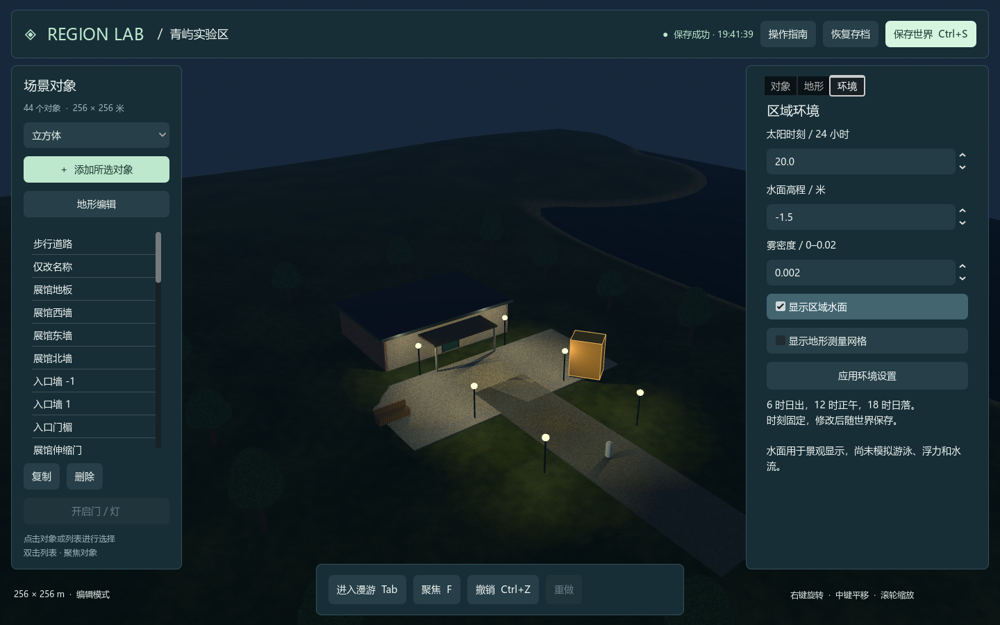
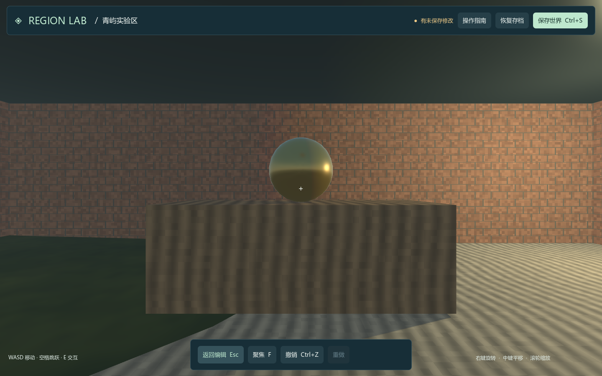

# V3 验证记录

版本：0.3.0。验证日期：2026-09-14。

## 1. 环境

| 项目 | 实测配置 |
| --- | --- |
| 操作系统 | Windows 11 家庭版中文版 x64，10.0.26200 |
| 脚本环境 | Windows PowerShell 5.1 |
| 引擎 | Godot 4.5.1 标准版，4.5.1.stable.official.f62fdbde1 |
| 渲染 | Compatibility，OpenGL 3.3 |
| 显卡 | NVIDIA GeForce RTX 5060 Laptop GPU，NVIDIA 592.01 |
| 物理 | Jolt；静态三角地形、原始几何、复合门及角色胶囊 |
| 依赖校验 | 官方压缩包和可执行文件 SHA512 与锁文件一致 |

## 2. 执行方法与结果

在 prototype 目录执行：

```powershell
powershell.exe -NoProfile -ExecutionPolicy Bypass -File .\tools\Test-RegionLab.ps1 -Visual
```

| 检查组 | 结果 | 主要覆盖内容 |
| --- | --- | --- |
| 原生数据、持久化和物理 | 136 / 136 通过 | 原有功能、环境校验、门灯状态、资产目录、迁移和真实碰撞 |
| 界面与渲染 | 50 / 50 通过 | 对象与地形编辑、环境页、门灯操作、建筑通行、保存恢复 |
| 独立进程恢复 | 通过 | 一个进程保存并退出，另一个进程恢复环境、门状态、材质、物体及地形 |
| 物体批处理 | 通过 | 创建固定 ID 方块、保存与查询 |
| 地形批处理 | 通过 | 设高、撤销、重做和保存；[80,80] 采样高程为 8 米 |
| 环境与行为批处理 | 通过 | 设置夜间环境、创建门、开门、保存并查询 |

报告：[汇总](evidence/summary.json)、[原生检查](evidence/native-report.json)、[界面检查](evidence/visual-report.json)。完整运行日志保留在各次本机 test-results/run-... 目录。

界面测试通过真实 Godot Viewport 注入点击与按键，属性输入通过控件赋值。50 项包含 5 项截图生成检查。截图用于审阅场景、中文显示和面板布局，不构成视觉质量评分或完整覆盖率。

## 3. 关键验证

| 类别 | 检查内容 |
| --- | --- |
| 环境 | 字段与类型边界、非有限数值、归属、无变化命令、撤销和重做 |
| 门 | 关闭时阻挡真实胶囊，打开后可以穿过门洞；按钮与 E 键改变相同状态 |
| 灯 | 开关改变实际 OmniLight3D 能量；状态可存档 |
| 对象 | 六类对象输入、非法材质、非均匀尺寸凸碰撞、资产引用完整性 |
| 迁移 | V1/V2 实际样本；保留 ID、地形和修订；读取不写盘；保存保留旧格式备份 |
| 存储 | 完整状态恢复、损坏校验、有效备份、写入失败及已有外部修改检测 |
| 地形 | 笔刷算法、非共面单元四点、更新及撤销后的网格和碰撞一致性 |
| 界面 | 环境页切换、交互距离、进入示例建筑、返回编辑、材质与状态恢复 |

存档数值恢复使用 1e-6 容差；指定地形射线与网格高度检查使用 0.002 米容差；椭球顶部检查使用 0.03 米容差；角色落地使用适合胶囊接触的 0.2 米容差。这些值是具体测试判据，未声明为全场景误差上界。

## 4. 独立目录复现

从待提交 Git 内容导出原型到同机全新、含空格的目录，不带引擎、.godot 缓存和用户存档。使用固定官方压缩包离线安装，首次启动先于编辑器导入及测试执行。

```powershell
.\Install.cmd -ArchivePath "<官方压缩包绝对路径>"
.\Start.cmd -WorldFile "$PWD\runtime\first-launch.json" -Screenshot "$PWD\test-results\first-launch.png"
powershell.exe -NoProfile -ExecutionPolicy Bypass -File .\tools\Test-RegionLab.ps1 -Visual
```

独立目录结果和被验证文件摘要见 [复现记录](evidence/clean-reproduction.json)。此步骤验证同一台 Windows 机器的新目录，不等同于全新操作系统测试。

## 5. 实际画面

日间场景：


夜间环境：



进入展馆：



## 6. 验证边界

- 当前交付为本机单用户；数据库、多人、身份认证、库存和完整脚本尚未实现。
- 原版固定 OpenSim 源码尚未完成独立构建与运行对照，映射仍以源码分析为依据。
- 没有导入无人机、CAD/BIM、OAR 或真实扫描资产；画面为程序化验证场景。
- 水面、太阳时刻和内置行为不是水动力、天文日照或完整脚本模拟。
- 未进行 500 对象、高分辨率地形、大量阴影灯光的容量基准。
- 未验证 Linux、macOS、Web、独立导出包、断电持久性或跨进程并发写入。
- 未接入在线模型，也未执行完整 GameFactory 生成流程。

后续验收条件见 [版本计划](../../docs/plans/stage-one-rebuild-plan.md)。
