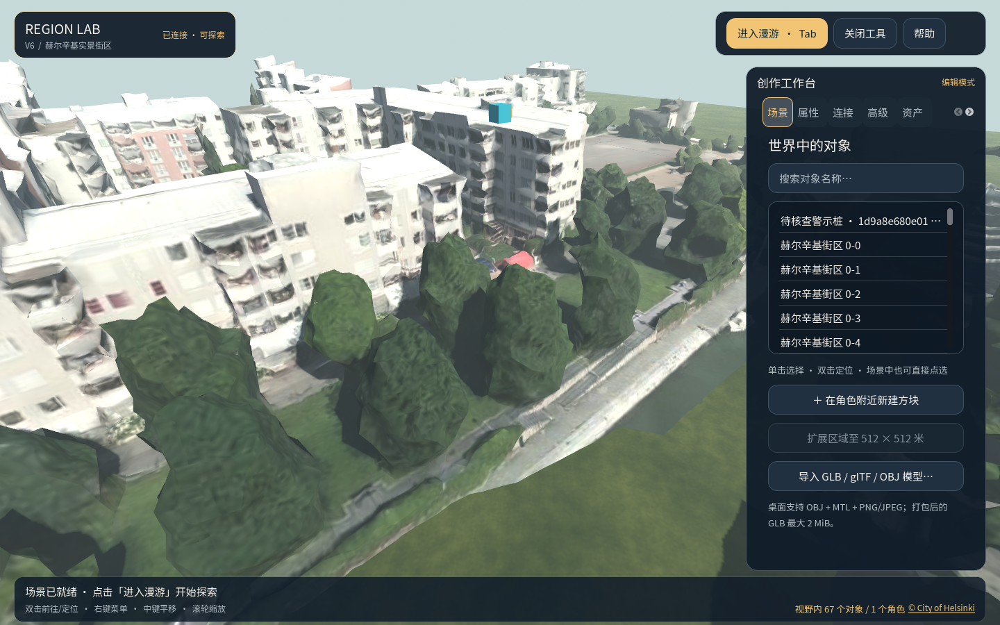

# 世界模型预测点实验

这个入口把一批已规范化的外部水位预测点，作为**局部可见标记**提交到正在运行的 Region Lab 权威区域。它使用 FP 0.3 `CreateObject` 命令及 SQLite 持久回执；审计目录保存原始数据摘要、模型身份、每个点的对象 ID、指令 trace、权威回执与修订号。单个预测点不表示整条道路被淹、整区水位或交通封闭。



## 一键打开演示

Windows 上先按[仓库首页](../../README.md)安装 Godot 4.5.1、构建 RegionStore 与 RegionHost，并准备 Node.js 24+、Python 3；推荐 PowerShell 7。然后双击 [`打开世界模型实验.cmd`](../打开世界模型实验.cmd)，或在仓库根目录运行 `.\prototype\打开世界模型实验.cmd`。脚本会优先使用 `pwsh.exe`，创建独立的 250 米赫尔辛基实例、校验并回注仓库中的**合成测试批次**、让受限 Agent 放置待核查警示桩，并打开桌面客户端。工作台“推演审阅”页可定位预测点、保存意见。运行数据与令牌保存在忽略 Git 的 `prototype/runtime/world-model-helsinki-250m` 目录。

这套演示使用端口 `20860–20862`。在演示会话默认的 7 天有效期内，再次运行会检查实例身份与进程，并复用同一批次；会话过期、更换数据或端口时，用 `Start-WorldModelDemo.ps1 -Directory <新目录>` 建立新实例。停止服务：

```powershell
.\prototype\tools\Stop-Network.ps1 -Directory .\prototype\runtime\world-model-helsinki-250m\network
```

下面是接入自己的模型批次时的手动流程。

## 准备

1. 使用 [`打开赫尔辛基250米实景.cmd`](../打开赫尔辛基250米实景.cmd) 启动 250 米真实街区。也可以用独立测试实例，但运行区的**名称、尺寸，以及全部网格对象的资产摘要、位置、尺寸与旋转**必须与所选场景清单一致。
2. 准备世界模型原始批次 JSON。样例 [`helsinki-synthetic-water.json`](../fixtures/world-model/helsinki-synthetic-water.json) 仅用于工程验收，预测时间是 2026-09-25，不是实时水情。
3. 使用 [`Map-WorldModelObservation.py`](../tools/Map-WorldModelObservation.py) 生成规范化记录；保留当时的原始 JSON 与场景 `manifest.json`，CLI 会重新读取二者并验证 SHA-256 和坐标计算。

以下命令在仓库根目录、PowerShell 7 中执行。`$output` 必须是新目录；重跑同一批次时可继续使用它。把实例目录改为实际启动的目录，令牌从本机私有配置读取，**不要写进共享脚本、截图或 Git**。

```powershell
$manifest = Resolve-Path .\prototype\fixtures\geodata\helsinki-kamppi-250m\manifest.json
$input = Resolve-Path .\prototype\fixtures\world-model\helsinki-synthetic-water.json
$normalized = Join-Path $PWD 'prototype\runtime\world-model\helsinki-normalized.json'
python .\prototype\tools\Map-WorldModelObservation.py $manifest $input $normalized `
  --as-of=2026-09-25T08:10:00Z --model-id=synthetic-water-demo --model-version=0.1.0

$config = Get-Content .\prototype\runtime\helsinki-kamppi-v7-250m\network\private-config.json -Raw | ConvertFrom-Json
$env:REGION_LAB_TOKEN = $config.principals[0].token
$output = Join-Path $PWD 'prototype\runtime\world-model\experiment-001'
node .\services\WorldModelExperiment.cjs `
  "--observation=$normalized" "--manifest=$manifest" "--input=$input" `
  '--url=ws://127.0.0.1:20831/ws' "--output=$output" --dry-run
node .\services\WorldModelExperiment.cjs `
  "--observation=$normalized" "--manifest=$manifest" "--input=$input" `
  '--url=ws://127.0.0.1:20831/ws' "--output=$output"
Remove-Item Env:REGION_LAB_TOKEN
```

`--dry-run`（`--preview` 同义）会连接权威服务，校验区尺寸、名称与网格实际摆放，并报告将新增多少标记，不修改世界。正式执行为每批建立一个灰色批次锚点，为每个样本建立一个青色预测点方块。标记名为 `预测点 · <sample_id> · <预测水位保留两位小数> m`。对象 ID 由来源、批次和样本 ID 稳定生成；同一批次重跑会读取已存在对象，不重复创建。若批次身份相同而原始数据变更，批次锚点的摘要冲突会拒绝应用。

预测点的**科学坐标**写在 `experiment.json` 的 `markers[].region_position`；其 Z 是输入水位相对场景源高程基线的映射值。为了在航拍网格上看见标记，青色方块放在对应 tile 包围盒上缘 2 米处；`markers[].visual_marker_position` 与 `display_offset_m` 记录显示位置和抬高距离。显示高度不代表预测水位，也不表示局部积水深度。源文件的 EGM96 标签与赫尔辛基市总体 N2000 说明仍有差异，在澄清高程基准前不能用此结果判断实际洪水风险。

## 可选的智能体核查动作

如果已有 `agent` 角色的会话令牌，可追加 `--agent-token=<令牌>`，或设置 `REGION_LAB_AGENT_TOKEN`。CLI 会让该 Agent 先 `observe` 预测点，再通过白名单 `create_box` 任务在第一个预测点旁建立橙色“待核查警示桩”，最后再次 `observe`。任务终态与前后观测写入实验审计。警示桩表示**待人工核查**，不是自动道路封闭决策。同一批次再次运行时，工具依据已完成任务回执中的对象 ID 复核警示桩的名称、位置和外观；仅有同名对象不会被当作 Agent 成果。

推荐从实例的私有配置或账户签发结果把 Agent 令牌设为环境变量，再执行上面的正式命令：

```powershell
$env:REGION_LAB_AGENT_TOKEN = '<本机 Agent 会话令牌>'
# 运行上面的 node services/WorldModelExperiment.cjs 正式命令
Remove-Item Env:REGION_LAB_AGENT_TOKEN
```

## 审计与边界

输出目录包含：

| 文件 | 内容 |
| --- | --- |
| `experiment.json` | 模型、来源、批次、三个 SHA-256、持久的 `world_instance_id`、首次应用的 `world_epoch`、最近重跑的 `latest_world_epoch`、首次完成时的起止修订与最近查看修订、样本 ID ↔ 标记对象 ID、科学与展示坐标、逐条权威回执和可选 Agent 任务。 |
| `events.jsonl` | 追加式预览、命令准备、回执、已有对象、Agent 观测和失败事件；适合追查部分提交。 |

若客户端断线或进程中断，先核对 `experiment.json` 的请求 ID、已提交对象与服务端回执，再以同一输出目录重跑。工具会复用已存在且内容一致的标记；不同内容不会覆盖旧标记。输出目录绑定一个持久 `world_instance_id`，即使两个实例使用同一场景与批次，也不能混用实验目录。旧版没有实例 ID 的实验目录须人工核对后改用新输出目录。当前批次不是服务器原生的原子多对象事务：部分点可先提交，失败时状态标为 `failed`，修复后可重跑补齐。首次完成后的 `revision_after` 不会因无修改重跑而变化；后续预览或可选 Agent 核查失败也不会抹去已完成状态，`latest_attempt_status` 和事件日志会记录新尝试的结果。Agent 任务记录仍是调用方审计文件，服务端 Agent 历史仅保存在内存中。

测试入口：先用 `Initialize-Network.ps1 -SeedWorld <赫尔辛基250米world.json>` 建立**全新实例**，再运行 `node services/Test-WorldModelExperiment.cjs --config=<实例private-config.json> --observation=<规范化记录> --manifest=<清单> --input=<原始批次> --output=<全新测试目录>`。该测试启动真实 Godot 权威服务，验证预览、持久回执、Agent 动作、重复批次、篡改摘要和观察者拒绝；加 `--visual=true` 时还启动本机资源网关与桌面客户端截图。
