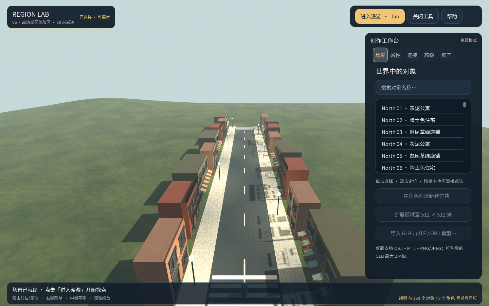
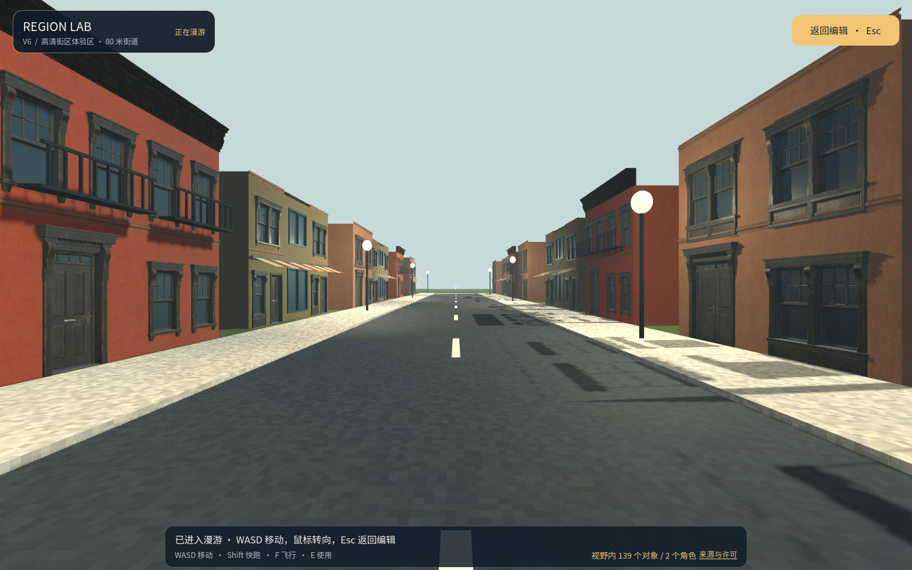

# 高清建筑与街道体验区

本目录保存一个可离线打开的静态城市建筑场景。两栋两层公寓使用同一份带 PBR 材质的 GLB，左侧公寓前另有一扇涂鸦金属卷帘窗；它们是建筑素材演示，**并不对应某个真实地址**。

## 来源与处理

- 建筑立面：[Poly Haven — Modular Urban Apartments Facade](https://polyhaven.com/a/modular_urban_apartments_facade)，作者 James Ray Cock，许可 [CC0](https://polyhaven.com/license)。
- 涂鸦卷帘窗：[Poly Haven — Rollershutter Window 01](https://polyhaven.com/a/rollershutter_window_01)，作者 MP，同为 CC0。
- 从官方 1K glTF 中选取门、窗、墙体和檐口模块，组装成两开间、两层的立面；添加简单的侧面、背面、屋顶和碰撞体。原始模块的几何和 UV 保留，九张漫反射、法线、金属度/粗糙度贴图以 1024×1024 嵌入 GLB。为了符合目前的静态导入器，玻璃改为不透明材质。
- 转换脚本为 [`Build-PolyHavenApartmentPilot.py`](../../../tools/Build-PolyHavenApartmentPilot.py)。原始下载文件存放在忽略提交的 `runtime/` 目录；运行脚本需安装 Pillow，并将官方 1K glTF、BIN 和依赖贴图放在同一源目录中。
- `urban-apartment.glb`：1,728,952 字节，SHA-256 `25252fd292eaf51da0cfba75061d886ea57105b542d277f3a2a2a40330d522e9`。
- 从官方 1K glTF 的普通、涂鸦两种展示件中选取涂鸦款，保留 552 个三角形和三张 1024×1024 的原始 JPEG PBR 贴图；用 [`Build-PolyHavenRollershutterPilot.py`](../../../tools/Build-PolyHavenRollershutterPilot.py) 转成自包含 GLB。脚本的 `--download-source` 可下载并核对 Poly Haven 官方文件。
- `rollershutter-window.glb`：1,642,608 字节，SHA-256 `04b987cac39de568aa78880dfc48868d6d6ad4ed8e4a1a3aa80625c31d9c4d18`。

## 打开

从 `prototype/` 双击 [`打开高清建筑模型体验.cmd`](../../../打开高清建筑模型体验.cmd)。脚本首次运行时在 `runtime/polyhaven-urban-apartment-v2/` 生成独立世界和网络实例；不会修改其他城市的存档。漫游出生点位于建筑正面，面对门窗。编辑视角用右键拖动旋转、中键拖动平移、滚轮缩放；按 `Tab` 进入漫游，按 `Esc` 返回编辑。

该模型是本项目当前导入预算内的清晰近景样例：贴图上限仍为 1024 像素，不能把它当成原始 8K 资产或完整实景扫描。真实地点需要另选带明确地理出处及许可的数据。

## 80 米街道演示

双击 [`prototype/打开高清街区体验.cmd`](../../../打开高清街区体验.cmd)，打开独立的 `runtime/polyhaven-street-v4/` 世界和本机服务。首次构建完成后，界面左上角显示“高清街区体验区”；点击“进入漫游”或按 **Tab**，从西端沿道路按 **W** 前进，按住 **Shift** 快跑，按 **F** 切换飞行，按 **Esc** 回到俯瞰。右键地面可选择前往，也可以在编辑权限下放置物体。

街道长约 80 米，两侧共有 16 栋建筑，复用三份带 1K PBR 贴图的 GLB；道路、人行道、标线、路灯及简化背面窗门由 123 个内置对象构成。原公寓之外，还从同一 CC0 模块集组装了赤陶色住宅和绿色店铺，转换脚本为 [`Build-PolyHavenApartmentVariants.py`](../../../tools/Build-PolyHavenApartmentVariants.py)。[`Build-PolyHavenStreetManifest.py`](../../../tools/Build-PolyHavenStreetManifest.py) 可复现包含校验和、位置和旋转的 [`street-manifest.json`](street-manifest.json)。`build_city_pilot.gd` 通过 WorldService 平整局部地形、放置对象、导入三份模型并保存，不会改动赫尔辛基或两栋公寓样例的存档。

| 文件 | 大小 | SHA-256 |
| --- | ---: | --- |
| `terracotta-residence.glb` | 1,855,600 B | `1d988e7d48e4d86457834a0ba4ddc959f175da38a83bd501866a885f32452eb0` |
| `sage-shopfront.glb` | 1,811,980 B | `692c611274d07395343ce2bc7a7949e7c4ae47606cebecce033183db49443c8c` |

这是一条为演示而拼装的街景。建筑不是某个地址的测绘件，背面窗门是简化装饰，室内不可进入；它适合展示导入、近看纹理和沿街漫游。要展示真实地点与较大地理范围，可使用本分支的[赫尔辛基 250 米航拍街区](../../../docs/helsinki-textured-city-pilot.md)。
