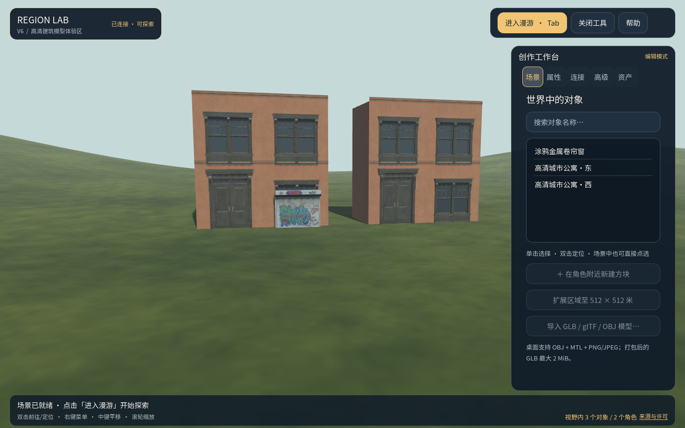

# 高清建筑模型体验区

本目录保存一个可离线打开的静态城市建筑场景。两栋两层公寓使用同一份带 PBR 材质的 GLB，左侧公寓前另有一扇涂鸦金属卷帘窗；它们是建筑素材演示，**并不对应某个真实地址**。

## 来源与处理

- 建筑立面：[Poly Haven — Modular Urban Apartments Facade](https://polyhaven.com/a/modular_urban_apartments_facade)，作者 James Ray Cock，许可 [CC0](https://polyhaven.com/license)。
- 涂鸦卷帘窗：[Poly Haven — Rollershutter Window 01](https://polyhaven.com/a/rollershutter_window_01)，作者 MP，同为 CC0。
- 从官方 1K glTF 中选取门、窗、墙体和檐口模块，组装成两开间、两层的立面；添加简单的侧面、背面、屋顶和碰撞体。原始模块的几何和 UV 保留，九张漫反射、法线、金属度/粗糙度贴图以 1024×1024 嵌入 GLB。为了符合目前的静态导入器，玻璃改为不透明材质。
- 转换脚本为 [`Build-PolyHavenApartmentPilot.py`](../../../tools/Build-PolyHavenApartmentPilot.py)。原始下载文件存放在忽略提交的 `runtime/` 目录；运行脚本需安装 Pillow，并将官方 1K glTF、BIN 和依赖贴图放在同一源目录中。
- `urban-apartment.glb`：1,728,952 字节，SHA-256 `25252fd292eaf51da0cfba75061d886ea57105b542d277f3a2a2a40330d522e9`。
- 从官方 1K glTF 的普通、涂鸦两种展示件中选取涂鸦款，保留 552 个三角形和三张 1024×1024 的原始 JPEG PBR 贴图；用 [`Build-PolyHavenRollershutterPilot.py`](../../../tools/Build-PolyHavenRollershutterPilot.py) 转成自包含 GLB。脚本的 `--download-source` 可下载并核对 Poly Haven 官方文件。
- `rollershutter-window.glb`：1,642,608 字节，SHA-256 `04b987cac39de568aa78880dfc48868d6d6ad4ed8e4a1a3aa80625c31d9c4d18`。

## 打开

从 `prototype/` 双击 [`打开高清建筑模型体验.cmd`](../../../打开高清建筑模型体验.cmd)。脚本首次运行时在 `runtime/polyhaven-urban-apartment-v2/` 生成独立世界和网络实例；不会修改其他城市的存档。漫游出生点位于建筑正面，面对门窗。编辑视角用右键拖动旋转、中键拖动平移、滚轮缩放；按 `Tab` 进入漫游，按 `Esc` 返回编辑。

该模型是本项目当前导入预算内的清晰近景样例：贴图上限仍为 1024 像素，不能把它当成原始 8K 资产或完整实景扫描。真实地点需要另选带明确地理出处及许可的数据。
